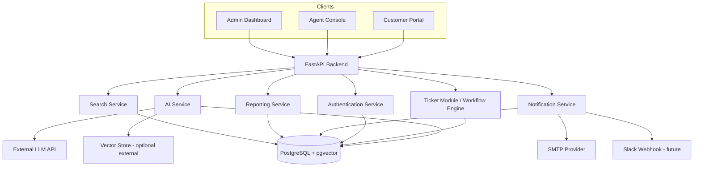
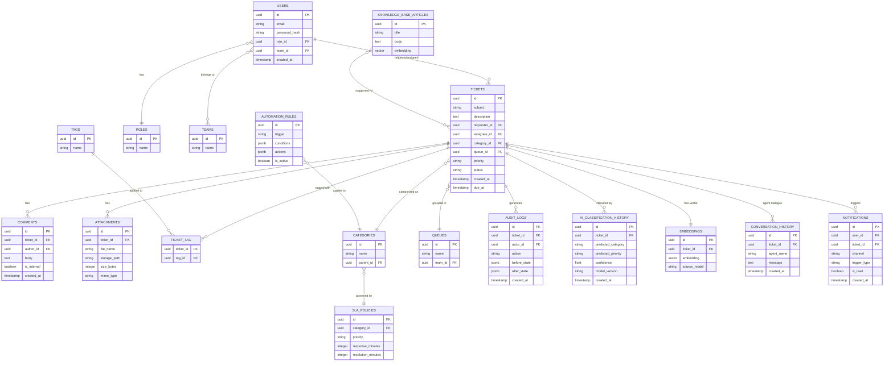
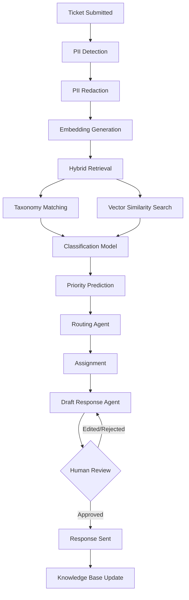

# Document 02 — TRD (Technical Requirements Document)
### AgentDesk — AI-Native Standalone Ticket Management Platform
*Expanded Software Architecture Specification — prepared for engineering implementation*

This document expands the original AgentDesk TRD by cross-referencing it against CubeAISolutions' Ticket Management Tool Requirements document. All original technology decisions are preserved below; new sections (1–20) add the architectural, API, database, and operational detail needed to hand this to an engineering team. Prototype-phase decisions are explicitly distinguished from future production enhancements throughout.

---

## Technology Stack Overview
*(preserved from the original TRD — see Section 20 for expanded constraints)*

### Frontend
React (with TypeScript), Tailwind CSS for styling, React Query for data fetching/caching.
*Not yet locked in with the CubeAISolutions team — proposed to pair naturally with the FastAPI backend and support a Jira/ServiceNow-style dashboard (tables, filters, real-time SLA widgets).*

### Backend
Python + FastAPI, serving the internal REST API for the ticket core (CRUD, workflow transitions, search/filter, reporting endpoints).
LangChain + LangGraph run as an orchestration layer within the same backend service, coordinating the multi-agent workflow (classification agent → routing agent → response/resolution agent).

### Database
PostgreSQL with the `pgvector` extension.
- Relational tables for tickets, users, teams, SLA rules, audit logs, workflow state
- `pgvector` columns for ticket embeddings, used in hybrid retrieval alongside the taxonomy tree (stored as a recursive/adjacency-list structure in Postgres)

### Auth
Prototype phase: simple email + password authentication with JWT sessions, role-based access control (Requester, Agent, Team Lead, Admin) enforced at the API layer.
SSO/OAuth (Google/Microsoft) is deferred — listed as Nice to Have in the PRD, to be added once the prototype validates core workflows.

### Hosting
Not yet finalized with CubeAISolutions IT — to be confirmed. Proposed default for the prototype phase: containerized deployment (Docker) on a single cloud VM (AWS/Azure/GCP), keeping frontend, backend, and Postgres co-located for simplicity during the 3-month internship window. Revisit for proper environment separation (dev/staging/prod) if the project moves toward production.

### Third-party APIs
| Service | Purpose | Tier |
|---|---|---|
| Anthropic Claude API **or** OpenAI API *(TBD)* | LLM reasoning for classification, routing decisions, and agent-drafted responses | Paid, usage-based |
| Pinecone **or** Chroma *(TBD)* | Vector storage for embeddings, if not handled entirely in `pgvector` | Pinecone: free tier available; Chroma: self-hosted/free |
| SMTP provider (e.g. SendGrid, Resend) | Ticket acknowledgment emails, notifications, SLA alerts | Free tier for prototype volume |
| Slack Webhook API *(future)* | Optional notification channel — listed as Nice to Have in PRD | Free |

*LLM provider, vector store, and classifier model are explicitly flagged as open decisions in the PRD/planning notes and should be confirmed before implementation locks in.*

### Key Libraries
- **LangChain / LangGraph** — multi-agent orchestration
- **FastAPI / Pydantic** — API layer and data validation
- **SQLAlchemy (or SQLModel)** — ORM for Postgres
- **pgvector** — embedding storage/similarity search
- **XGBoost** or **Hugging Face Transformers (DistilBERT)** *(TBD)* — supervised classifier for category/priority
- **React Query** — frontend data fetching/caching
- **Zod** — frontend/API input validation
- **Recharts or Chart.js** — dashboard metrics (SLA compliance, workload, resolution time)
- **Lucide Icons** — UI iconography

### Environment Variables
- `DATABASE_URL`
- `ANTHROPIC_API_KEY` / `OPENAI_API_KEY` *(whichever LLM provider is chosen)*
- `VECTOR_DB_API_KEY` *(if Pinecone is used instead of pgvector-only)*
- `JWT_SECRET`
- `SMTP_HOST`
- `SMTP_PORT`
- `SMTP_USER`
- `SMTP_PASSWORD`
- `SLACK_WEBHOOK_URL` *(future)*
- `APP_ENV`

---

## 1. System Architecture

AgentDesk is a standalone, AI-native ticket management platform. It has three user-facing surfaces (Customer Portal, Agent Console, Admin Dashboard), all served by a single FastAPI backend that hosts the ticket core, the AI service layer, and supporting services (auth, notifications, reporting, search). No component depends on an external ServiceNow/Jira instance.

**Component responsibilities**

| Component | Responsibility |
|---|---|
| Customer Portal | Ticket submission, tracking, knowledge base browsing (Requester role) |
| Agent Console | Ticket queue, ticket detail view, macros, assignment actions (Agent/Team Lead roles) |
| Admin Dashboard | Configuration of statuses, categories, SLA rules, automation, users (Admin role) |
| FastAPI Backend | Single API surface exposing all REST endpoints; hosts business logic and routes requests to internal services |
| AI Service | Hosts the hybrid retrieval, classification, routing, and multi-agent orchestration (LangGraph) logic |
| Authentication Service | Login, JWT issuance/refresh, RBAC enforcement |
| Notification Service | Email/in-app/Slack delivery, triggered by workflow events |
| Reporting Service | Aggregates ticket data into dashboard metrics and exportable reports |
| Search Service | Full-text + vector hybrid search across tickets and knowledge base |
| Database | PostgreSQL + pgvector — single source of truth for all relational and embedding data |
| External Integrations | LLM API, vector store (if external), SMTP provider, Slack webhook |

**Request flow (typical ticket lifecycle):**
1. Requester submits a ticket via the Customer Portal → FastAPI `Tickets` endpoint.
2. Backend persists the ticket, then hands off to the AI Service for PII redaction, embedding, classification, and routing (see Section 5).
3. Routing Service assigns the ticket to a queue/agent; Notification Service alerts the assignee.
4. Agent works the ticket via the Agent Console; status changes flow back through the Workflow Engine, updating SLA timers and audit logs.
5. Reporting Service continuously aggregates ticket events for the Admin Dashboard.

---

## 2. Detailed Backend Architecture

The FastAPI backend is organized into modules, each owning a bounded piece of functionality. Modules communicate in-process during the prototype phase (no separate microservices) but are structured so they could be split into independent services later.

| Module | Responsibility |
|---|---|
| **Authentication Module** | User login, JWT issuance/validation, refresh tokens, password reset, RBAC checks |
| **Ticket Module** | Ticket CRUD, comments, attachments, merge/split, reopen |
| **Workflow Engine** | Status transitions, state machine enforcement, status history/audit trail |
| **AI Classification Service** | PII redaction, embedding generation, taxonomy + vector hybrid retrieval, classification/priority model inference |
| **Routing Service** | Applies routing rules (manual, round-robin, load-balanced, category-based); LangGraph routing agent |
| **Search Service** | Full-text + vector hybrid search, saved views, filters |
| **Reporting Service** | Dashboard metrics, CSV/PDF/Excel export, custom date-range queries |
| **Notification Service** | Notification triggers, delivery via email/in-app/Slack, template rendering |
| **SLA Service** | SLA policy evaluation, countdown tracking, breach detection and escalation |
| **Admin Configuration Service** | Manages statuses, categories, priorities, queues, tags, branding, notification templates |
| **Knowledge Base Service** | Article CRUD, suggested-article matching during ticket creation |
| **Audit Service** | Records all admin/configuration changes and ticket status changes for compliance |

Each module exposes an internal service interface (Python class/function boundary in the prototype) consumed by the API router layer, keeping request handlers thin and business logic testable in isolation.

---

## 3. API Design

All endpoints are prefixed with `/api/v1`. Authentication is via `Authorization: Bearer <JWT>` unless noted. Response bodies are JSON.

### Authentication
| Method | URL | Purpose | Auth Required | Expected Response |
|---|---|---|---|---|
| POST | `/auth/login` | Authenticate user, issue JWT + refresh token | No | `{access_token, refresh_token, user}` |
| POST | `/auth/refresh` | Exchange refresh token for new access token | No (refresh token) | `{access_token}` |
| POST | `/auth/logout` | Invalidate refresh token | Yes | `204 No Content` |
| POST | `/auth/password-reset/request` | Send password reset email | No | `202 Accepted` |
| POST | `/auth/password-reset/confirm` | Set new password with reset token | No | `200 OK` |
| POST | `/auth/verify-email` | Confirm email address | No (verification token) | `200 OK` |

### Users
| Method | URL | Purpose | Auth Required | Expected Response |
|---|---|---|---|---|
| GET | `/users` | List users (filterable by team/role) | Yes (Admin/Team Lead) | `[User]` |
| GET | `/users/{id}` | Get user detail | Yes | `User` |
| POST | `/users` | Create user | Yes (Admin) | `User` |
| PATCH | `/users/{id}` | Update user/team/role | Yes (Admin) | `User` |
| DELETE | `/users/{id}` | Deactivate user | Yes (Admin) | `204 No Content` |

### Tickets
| Method | URL | Purpose | Auth Required | Expected Response |
|---|---|---|---|---|
| GET | `/tickets` | List/filter tickets | Yes | `[Ticket]` (paginated) |
| GET | `/tickets/{id}` | Get ticket detail | Yes | `Ticket` |
| POST | `/tickets` | Create ticket (triggers AI pipeline) | Yes | `Ticket` |
| PATCH | `/tickets/{id}` | Update ticket fields | Yes | `Ticket` |
| POST | `/tickets/{id}/merge` | Merge into another ticket | Yes (Agent+) | `Ticket` |
| POST | `/tickets/{id}/split` | Split into sub-tasks | Yes (Agent+) | `[Ticket]` |
| POST | `/tickets/{id}/reopen` | Reopen within allowed window | Yes | `Ticket` |

### Comments
| Method | URL | Purpose | Auth Required | Expected Response |
|---|---|---|---|---|
| GET | `/tickets/{id}/comments` | List comments/notes on a ticket | Yes | `[Comment]` |
| POST | `/tickets/{id}/comments` | Add public reply or internal note | Yes | `Comment` |
| PATCH | `/comments/{id}` | Edit a comment | Yes (author/Admin) | `Comment` |
| DELETE | `/comments/{id}` | Delete a comment | Yes (author/Admin) | `204 No Content` |

### Attachments
| Method | URL | Purpose | Auth Required | Expected Response |
|---|---|---|---|---|
| POST | `/tickets/{id}/attachments` | Upload file to a ticket | Yes | `Attachment` |
| GET | `/attachments/{id}` | Download/stream a file | Yes | Binary stream |
| DELETE | `/attachments/{id}` | Remove an attachment | Yes (Agent+/Admin) | `204 No Content` |

### Assignment
| Method | URL | Purpose | Auth Required | Expected Response |
|---|---|---|---|---|
| POST | `/tickets/{id}/assign` | Assign/reassign ticket to agent or queue | Yes (Agent+) | `Ticket` |
| POST | `/tickets/{id}/escalate` | Escalate to Team Lead | Yes (Agent+) | `Ticket` |

### Status Updates
| Method | URL | Purpose | Auth Required | Expected Response |
|---|---|---|---|---|
| PATCH | `/tickets/{id}/status` | Change ticket status (validated against workflow state machine) | Yes | `Ticket` |
| GET | `/tickets/{id}/status-history` | Retrieve status/audit history | Yes | `[StatusChange]` |

### Search
| Method | URL | Purpose | Auth Required | Expected Response |
|---|---|---|---|---|
| GET | `/search/tickets?q=` | Hybrid full-text + vector search | Yes | `[Ticket]` |
| GET | `/search/views` | List saved/custom views | Yes | `[SavedView]` |
| POST | `/search/views` | Create a saved view | Yes | `SavedView` |

### Dashboard
| Method | URL | Purpose | Auth Required | Expected Response |
|---|---|---|---|---|
| GET | `/dashboard/metrics` | Open tickets, avg. resolution time, SLA compliance, workload | Yes | `DashboardMetrics` |

### Reports
| Method | URL | Purpose | Auth Required | Expected Response |
|---|---|---|---|---|
| POST | `/reports/generate` | Generate report for a date range | Yes | `Report` |
| GET | `/reports/{id}/export?format=csv|pdf|xlsx` | Export a generated report | Yes | Binary file |

### Notifications
| Method | URL | Purpose | Auth Required | Expected Response |
|---|---|---|---|---|
| GET | `/notifications` | List in-app notifications for current user | Yes | `[Notification]` |
| PATCH | `/notifications/{id}/read` | Mark notification as read | Yes | `204 No Content` |
| PATCH | `/notifications/preferences` | Update per-user trigger/channel preferences | Yes | `NotificationPreferences` |

### Knowledge Base
| Method | URL | Purpose | Auth Required | Expected Response |
|---|---|---|---|---|
| GET | `/kb/articles` | List/search articles | No (public portal) | `[Article]` |
| GET | `/kb/articles/{id}` | Get article detail | No | `Article` |
| POST | `/kb/articles` | Create article | Yes (Agent+) | `Article` |
| PATCH | `/kb/articles/{id}` | Update article | Yes (Agent+) | `Article` |
| GET | `/kb/suggest?ticket_draft=` | Suggest articles during ticket creation | No | `[Article]` |

### Admin Configuration
| Method | URL | Purpose | Auth Required | Expected Response |
|---|---|---|---|---|
| GET | `/admin/config` | Retrieve current system configuration | Yes (Admin) | `Config` |
| PATCH | `/admin/config` | Update statuses, branding, general settings | Yes (Admin) | `Config` |

### Categories / Priorities / SLA Rules / Automation Rules / Queues / Tags
| Method | URL | Purpose | Auth Required | Expected Response |
|---|---|---|---|---|
| GET / POST | `/admin/categories` | List/create ticket categories | Yes (Admin) | `[Category]` / `Category` |
| PATCH / DELETE | `/admin/categories/{id}` | Update/delete a category | Yes (Admin) | `Category` / `204` |
| GET / POST | `/admin/priorities` | List/create priority levels | Yes (Admin) | `[Priority]` / `Priority` |
| GET / POST | `/admin/sla-rules` | List/create SLA policies | Yes (Admin) | `[SLARule]` / `SLARule` |
| PATCH / DELETE | `/admin/sla-rules/{id}` | Update/delete an SLA policy | Yes (Admin) | `SLARule` / `204` |
| GET / POST | `/admin/automation-rules` | List/create automation rules (trigger/condition/action) | Yes (Admin) | `[AutomationRule]` / `AutomationRule` |
| PATCH / DELETE | `/admin/automation-rules/{id}` | Update/delete an automation rule | Yes (Admin) | `AutomationRule` / `204` |
| GET / POST | `/admin/queues` | List/create queues/departments | Yes (Admin) | `[Queue]` / `Queue` |
| GET / POST | `/tags` | List/create tags | Yes | `[Tag]` / `Tag` |
| POST | `/tickets/{id}/tags` | Attach a tag to a ticket | Yes | `Ticket` |

### Webhooks
| Method | URL | Purpose | Auth Required | Expected Response |
|---|---|---|---|---|
| GET | `/webhooks` | List registered webhooks | Yes (Admin) | `[Webhook]` |
| POST | `/webhooks` | Register a webhook (event type + target URL) | Yes (Admin) | `Webhook` |
| DELETE | `/webhooks/{id}` | Remove a webhook | Yes (Admin) | `204 No Content` |

---

## 4. Database Design

PostgreSQL is the single data store, with the `pgvector` extension enabling similarity search directly alongside relational data — avoiding a separate vector database for the prototype phase and keeping embeddings transactionally consistent with the ticket they belong to.

**Key relationships:** Tickets reference `requester_id` and `assignee_id` (both FK → `USERS`), `category_id` (FK → `CATEGORIES`), and `queue_id` (FK → `QUEUES`). `TICKET_TAG` is a many-to-many join table between `TICKETS` and `TAGS`. `EMBEDDINGS` and `AI_CLASSIFICATION_HISTORY` both reference `ticket_id`, keeping every AI decision traceable back to its ticket.

**Indexes:** B-tree indexes on all foreign keys (`ticket_id`, `assignee_id`, `category_id`, `queue_id`); a GIN index on `TICKETS.tags` (via `TICKET_TAG`) and on full-text search columns (`subject`, `description`) using Postgres FTS `tsvector`; an IVFFlat or HNSW index on `EMBEDDINGS.embedding` and `KNOWLEDGE_BASE_ARTICLES.embedding` for approximate nearest-neighbor vector search.

**Why pgvector:** it keeps embeddings in the same transactional database as the ticket data, so a ticket, its classification history, and its embedding are always consistent — no separate vector DB to synchronize during the prototype phase. If retrieval volume outgrows pgvector's performance envelope, the `EMBEDDINGS` table can be migrated to Pinecone/Chroma later without changing the relational schema.

---

## 5. AI Processing Pipeline

This is the core of AgentDesk's AI-first design: every ticket passes through a LangGraph-orchestrated pipeline before reaching an agent.

**Stage-by-stage explanation:**

1. **Ticket Submitted** — request arrives via web form, email, or chat widget and is persisted with status `New`.
2. **PII Detection** — a lightweight NER/regex pass flags emails, phone numbers, IDs, and other sensitive spans in the raw text.
3. **PII Redaction** — flagged spans are masked before the content is sent to any external LLM API, protecting requester privacy.
4. **Embedding Generation** — the redacted ticket text is embedded (via the chosen LLM/embedding provider) and stored in `EMBEDDINGS`.
5. **Hybrid Retrieval** — runs both retrieval paths in parallel:
   - **Taxonomy Matching** — walks the hierarchical category tree to find the closest existing node.
   - **Vector Similarity Search** — `pgvector` similarity search against historical tickets and knowledge base articles.
6. **Classification Model** — combines taxonomy and vector signals with the supervised classifier (XGBoost/DistilBERT) and an LLM reasoning pass to produce a final category prediction, recorded in `AI_CLASSIFICATION_HISTORY` with a confidence score.
7. **Priority Prediction** — the same hybrid model estimates urgency (Low/Medium/High/Critical) based on content and category.
8. **Routing Agent** — a LangGraph agent applies routing rules (manual override, round-robin, load-balanced, category-based) to select a queue/agent.
9. **Assignment** — the ticket is written to the assignee/queue; the Notification Service fires an assignment alert.
10. **Draft Response Agent** — for common/well-understood issue types, an agent drafts a suggested reply using canned templates + LLM generation, referencing relevant knowledge base articles.
11. **Human Review** — during the prototype phase, all AI-drafted responses require agent approval before sending (human-in-the-loop is mandatory, not optional, until confidence and accuracy are validated against real data).
12. **Response Sent** — once approved (edited or as-is), the reply is delivered to the requester and the conversation is logged in `CONVERSATION_HISTORY`.
13. **Knowledge Base Update** — resolved tickets that introduce a new pattern are flagged for potential knowledge base article creation, closing the loop for future deflection.

**LangGraph orchestration:** each stage from Classification through Draft Response is modeled as a node in a LangGraph graph, with conditional edges (e.g. low-confidence classification routes to a "needs human categorization" branch instead of auto-routing). State (ticket content, redacted text, embeddings, classification result, draft response) is passed as a typed graph state object between nodes, giving the pipeline both traceability and the ability to insert new agents later (e.g. an SLA-risk agent) without restructuring existing stages.

**Human-in-the-loop:** is enforced at two points in the prototype — (a) low-confidence classifications are routed to an agent for manual categorization rather than auto-assigned, and (b) all AI-drafted responses require explicit agent approval before sending. This preserves trust while the models are validated against real ticket data; auto-send for high-confidence, low-risk categories is a documented future enhancement, not a prototype default.

---

## 6. Search Architecture

Search combines Postgres-native full-text search with vector similarity for a hybrid ranking approach, avoiding a separate search engine (e.g. Elasticsearch) during the prototype phase.

- **Postgres FTS**: `tsvector`/`tsquery` full-text indexes over `subject`, `description`, and `comments.body`, supporting ranked keyword search.
- **pg_trgm**: trigram indexes for fuzzy/typo-tolerant matching on subject lines and tags (e.g. partial matches, misspellings).
- **Hybrid vector search**: `pgvector` cosine similarity over ticket and knowledge-base embeddings, surfacing semantically related tickets even without shared keywords.
- **Metadata filtering**: structured filters (status, priority, category, assignee, date range, tags) applied as SQL `WHERE` clauses alongside the text/vector query.
- **Ranking**: results are ranked by a weighted blend of FTS rank, trigram similarity, and vector cosine distance, with metadata filters applied first to narrow the candidate set before ranking.

**Search coverage**: ticket subject, description, comments (public + internal notes), tags, attachment file names/metadata (not file contents, in the prototype), and knowledge base articles.

---

## 7. Notification Architecture

| Channel | Status |
|---|---|
| Email | Must Have — prototype default |
| In-app | Must Have — prototype default |
| Slack | Nice to Have — future |
| Microsoft Teams | Nice to Have — future |
| SMS | Out of scope for now — future |

**Notification triggers:** ticket assignment, status change, new reply, SLA breach/near-breach, escalation, and scheduled reminders (e.g. "ticket idle for 3 days").

**Delivery model:** notification events are written to a lightweight outbox table when triggered by the Workflow Engine or SLA Service, then processed asynchronously by a background worker (see Section 11) so that ticket-update requests are never blocked waiting on SMTP or webhook delivery. Each user has per-trigger, per-channel preferences (`/notifications/preferences`), so an agent could disable email but keep in-app alerts, for example.

---

## 8. File Storage

| Aspect | Prototype Decision | Future Enhancement |
|---|---|---|
| Supported file types | Images, PDFs, common office docs (docx/xlsx/pptx) | Expand as needed |
| Storage approach | Local disk storage under the backend container, path recorded in `ATTACHMENTS.storage_path` | Cloud object storage (S3/Azure Blob/GCS) with signed URLs |
| Upload validation | MIME-type and extension allowlist, max file size enforced server-side | Add deeper content validation |
| File size limits | Configurable via Admin Configuration Service (default e.g. 10MB) | Per-org tiered limits |
| Virus scanning | Not implemented in prototype | Integrate ClamAV or cloud-native scanning before production |
| Attachment metadata | File name, size, MIME type, uploader, ticket link stored in `ATTACHMENTS` | Add checksum/hash for integrity verification |

---

## 9. Authentication & Authorization

- **JWT**: short-lived access tokens (e.g. 15–30 min) signed with `JWT_SECRET`, carrying user ID and role claims.
- **Refresh tokens**: longer-lived, stored server-side (or as httpOnly cookies) to allow silent re-authentication without re-entering credentials.
- **Password hashing**: bcrypt or argon2 for stored password hashes — plaintext passwords are never persisted or logged.
- **Session expiry**: access tokens expire quickly; refresh tokens expire after a configurable inactivity window and are revocable (e.g. on logout or password reset).
- **Password reset / account recovery**: token-based reset flow via email (`/auth/password-reset/request` → emailed link → `/auth/password-reset/confirm`).
- **Email verification**: new accounts require email confirmation before full access (Admin-created accounts in the prototype may skip this if provisioned directly).
- **OAuth / SSO**: deferred to a future phase (Google/Microsoft), as noted in the PRD's Nice to Have list — the auth module is structured so an OAuth provider can be added alongside, not instead of, password auth.
- **RBAC implementation**: roles (Requester, Agent, Team Lead, Admin) are stored in the `ROLES` table and enforced via a FastAPI dependency that checks the JWT's role claim against each endpoint's required permission.
- **Permission model**: coarse-grained role checks in the prototype (role → allowed endpoints); a finer-grained permission-per-action model is a natural future enhancement if CubeAISolutions needs custom roles.

---

## 10. Security

| Area | Prototype Approach |
|---|---|
| TLS / HTTPS | All traffic served over HTTPS (terminated at the hosting layer, e.g. reverse proxy or platform-managed TLS) |
| Encryption at rest | Postgres volume encryption via the hosting provider's disk encryption |
| JWT security | Short expiry, signed with a strong secret, validated on every request |
| Password hashing | bcrypt/argon2, never reversible, never logged |
| Rate limiting | Basic per-IP/per-user rate limiting on auth and ticket-creation endpoints to deter abuse |
| Input validation | Pydantic models validate all request payloads at the API boundary |
| SQL injection prevention | ORM (SQLAlchemy/SQLModel) with parameterized queries — no raw string-built SQL |
| XSS prevention | Frontend escapes all rendered user content; API never returns unsanitized HTML |
| CSRF considerations | JWT-in-header auth model (not cookie-based sessions) minimizes CSRF exposure; if cookies are used for refresh tokens, `SameSite`/`httpOnly` flags are required |
| Secure headers | Standard security headers (CSP, X-Content-Type-Options, X-Frame-Options) set at the API/reverse-proxy layer |
| Secrets management | All credentials via environment variables (see Environment Variables list), never committed to source control |
| PII protection | PII redaction at ticket intake (Section 5) before any data reaches an external LLM API |
| Audit logging | All ticket status changes and admin/configuration changes recorded in `AUDIT_LOGS` with actor, before/after state, and timestamp |

---

## 11. Background Jobs

Asynchronous processing is required so that user-facing requests (e.g. creating a ticket) are never blocked on slower operations. For the prototype, a simple task queue (e.g. FastAPI `BackgroundTasks` for lightweight jobs, or Celery/RQ with Redis if job volume grows) handles:

- Email sending (acknowledgments, notifications, SLA alerts)
- Embedding generation (LLM/embedding API calls)
- SLA monitoring (periodic scan for tickets approaching/breaching SLA)
- Notification delivery (outbox processing across email/in-app/Slack)
- AI processing (classification, routing, draft response generation)
- Report generation (aggregating data for scheduled/on-demand reports)
- Scheduled cleanup (e.g. purging expired password-reset tokens)

*Suitable technologies:* FastAPI `BackgroundTasks` for simple fire-and-forget jobs during the prototype; Celery or RQ with Redis as a broker if the internship timeline allows, giving retries, scheduling (via Celery Beat), and better observability for production readiness.

---

## 12. Reporting Module

- **Dashboard metrics**: open ticket count, average resolution time, SLA compliance rate, agent workload distribution — served live via `/dashboard/metrics`.
- **Export formats**: CSV, PDF, and Excel (`.xlsx`) via `/reports/{id}/export`.
- **Custom date ranges**: all report queries accept a `start_date`/`end_date` filter.
- **Agent productivity**: tickets resolved per agent, average handle time.
- **SLA compliance**: percentage of tickets meeting response/resolution targets, broken down by category/priority.
- **Ticket trends**: volume over time, recurring issue detection (feeds the future trend/root-cause detection agent from the PRD's Nice to Have list).
- **Category analytics**: ticket distribution across categories/sub-categories.
- **AI performance metrics**: classification accuracy vs. human-corrected labels, auto-routing acceptance rate, draft-response approval/edit rate — critical for validating the AI pipeline against the PRD's success metrics.

---

## 13. Configuration System

The Admin Configuration Service centralizes everything an Admin can change without a code deployment:

- Ticket statuses, categories/sub-categories, priority levels
- Queues/departments and team assignments
- Automation rules (see Section 14)
- SLA rules (per category/priority response and resolution targets)
- Role permissions (coarse-grained in the prototype)
- Notification templates (per trigger type)
- Canned/predefined response templates (macros)
- Branding (logo, portal theme) for the customer-facing portal

All configuration changes are written through `/admin/config` and related endpoints and recorded in `AUDIT_LOGS`.

---

## 14. Automation Engine

Automation rules follow a **trigger → condition → action** model, stored as JSONB in `AUTOMATION_RULES` for flexibility without a schema migration per new rule type.

- **Triggers**: ticket created, status changed, SLA nearing breach, tag added, comment added.
- **Conditions**: category equals X, priority is Critical, requester is VIP, ticket idle for N hours.
- **Actions**: auto-assign to queue/agent, change priority, add tag, send notification, escalate to Team Lead.
- **Escalation rules**: a specialization of automation rules focused on SLA-breach conditions escalating to a Team Lead or alternate queue.
- **Assignment rules**: round-robin, load-balanced, and category-based assignment are implemented as built-in rule templates rather than fully custom rules, simplifying the Admin UI while still covering FR3.2 from the requirements document.
- **Workflow automation**: the rule engine evaluates active rules against each ticket event synchronously at write time for simple actions (e.g. auto-tag) and asynchronously via background jobs for actions involving notifications or external calls.

---

## 15. Performance Requirements (Non-Functional)

| Metric | Target (Prototype) |
|---|---|
| Dashboard load time | Under 2–3 seconds |
| Search latency | Under 1 second for hybrid search on prototype-scale data |
| Classification latency | Under 3 seconds per ticket (including LLM round-trip) |
| Concurrent users | Support at least [X] concurrent users — to confirm expected load with CubeAISolutions |
| Availability | 99.5%+ target (best-effort during prototype; not SLA-backed until production) |
| Scalability | Architecture should scale horizontally (stateless FastAPI instances behind a load balancer) as ticket volume grows |
| Caching | Response caching for dashboard metrics and read-heavy endpoints (e.g. category/priority lists) to reduce database load |
| Database optimization | Indexes per Section 4; query plans reviewed for the search and dashboard endpoints specifically, as they are the highest-read paths |

---

## 16. Deployment Architecture

| Environment | Purpose |
|---|---|
| Development | Local Docker Compose (frontend, backend, Postgres) for day-to-day internship development |
| Testing | Isolated environment/database for automated tests and manual QA before merging |
| Production | Not in scope for this internship phase — architecture should not block a future production rollout |

- **Docker**: backend, frontend, and Postgres each containerized; `docker-compose.yml` for local/dev orchestration.
- **CI/CD**: basic pipeline (e.g. GitHub Actions) running lint/tests on push; deployment automation is a stretch goal given the 3-month timeline, not a hard requirement.
- **Database migrations**: managed via Alembic (paired with SQLAlchemy/SQLModel) so schema changes are versioned and repeatable across environments.
- **Environment variables**: managed via `.env` files locally (excluded from source control) and injected via the hosting platform's secret store in any deployed environment.
- **Logging**: structured JSON logs from the backend, shipped to stdout (container-native), viewable via the hosting platform's log viewer during the prototype.
- **Monitoring**: basic uptime/health checks; deeper APM (e.g. Datadog, New Relic) is a future enhancement, not required for a prototype.
- **Health endpoints**: `/health` (liveness) and `/health/ready` (readiness, checks DB connectivity) for container orchestration and monitoring.

---

## 17. Logging & Monitoring

- **Application logs**: structured request/response logs (method, path, status, latency) for general observability.
- **Error logs**: unhandled exceptions logged with stack traces and request context.
- **Audit logs**: persisted in `AUDIT_LOGS` (distinct from application logs — these are business-data records, not operational logs).
- **AI logs**: every classification/routing decision logged with model version, confidence, and input reference (via `AI_CLASSIFICATION_HISTORY`), enabling later accuracy analysis against the PRD's success metrics.
- **Metrics**: request counts, latency percentiles, error rates, background job success/failure counts.
- **Tracing**: not required for the prototype scale; a future enhancement if the system grows into multiple services.
- **Monitoring & alerts**: basic alerting on health-check failures and background-job failure rates; deeper alerting (SLA-breach volume spikes, classification-confidence drops) is a natural extension of the Reporting Service.

---

## 18. Interfaces

| Interface | Primary Users | Notes |
|---|---|---|
| Customer Portal | Requesters | Ticket submission, tracking, knowledge base search; simplest surface, optimized for self-service |
| Agent Console | Support Agents, Team Leads | Ticket queue, detail view, macros, assignment/escalation controls, SLA countdowns |
| Admin Dashboard | Admins | Configuration of statuses/categories/SLA/automation, user management, audit logs, reporting exports |

**Responsive behavior**: all three interfaces are mobile/tablet-responsive (per the requirement document's usability expectations), though native mobile apps remain explicitly out of scope.
**Browser support**: latest versions of Chrome, Firefox, Edge, and Safari, matching the requirement document's browser support expectation.

---

## 19. Backup & Disaster Recovery

- **Automated backups**: daily automated Postgres backups (via the hosting provider's managed backup feature or a scheduled `pg_dump` job during the prototype).
- **Recovery**: documented restore procedure from the most recent backup; tested at least once during the internship to confirm viability.
- **Database restore**: point-in-time restore is a future enhancement if the hosting provider supports it; daily full backups are sufficient for the prototype phase.
- **Retention**: backups retained for a rolling window (e.g. 7–14 days) during the prototype; formal retention policy to be defined with CubeAISolutions if the system moves toward production.

---

## 20. Technical Constraints

*(expands the original Constraints section — all prior constraints remain in force)*

- Must remain a **standalone system** — no dependency on or integration with an existing ServiceNow/Jira instance (locked-in architectural decision)
- Current phase is **prototyping**, not production deployment — scoped to the 3-month internship timeline
- LLM provider, vector store, and classifier model choices are still open and should default to free/self-hosted options where possible until confirmed
- No confirmed infrastructure/hosting budget yet — prefer free-tier or low-cost services during the prototype phase
- Must respect CubeAISolutions' internal data handling expectations (PII redaction at intake, per PRD)
- Should stay flexible enough to add SSO, Slack/Teams integration, and multi-tenancy later without a core rewrite
- Human-in-the-loop is mandatory for AI-drafted responses during the prototype — full auto-send is out of scope until accuracy is validated
- Native mobile apps, multi-tenancy, and formal compliance certification (e.g. SOC2) remain explicitly out of scope, per the PRD
- Implementation should avoid unnecessary enterprise complexity (e.g. no microservice split, no external search engine, no separate vector DB) unless a specific bottleneck justifies it — the prototype favors a single well-structured FastAPI application over premature distributed-systems overhead
