# Document 03 — App Flow Document
### AgentDesk — AI-Native Standalone Ticket Management Platform

This document maps how users move through AgentDesk across its three surfaces — Customer Portal, Agent Console, and Admin Dashboard — so that every screen connects into one coherent product rather than being built in isolation. It builds on the PRD (Document 01) and TRD (Document 02), and incorporates the relevant flows from CubeAISolutions' Ticket Management Tool Requirements document (ticket lifecycle, RBAC, SLA, notifications, reporting).

---

## 1. Screens / Pages

### Customer Portal (Requester)
| Screen | Description |
|---|---|
| Login / Sign Up | Authenticate or self-register as a requester |
| Password Reset | Request and confirm a new password |
| My Tickets (home) | List of the requester's own tickets, filterable by status; default landing page after login |
| New Ticket | Submission form (Subject, Description, Category, Priority, Attachments); shows suggested KB articles as the requester types |
| Ticket Detail | Thread of replies, current status, SLA-facing info (e.g. "expected response by"), reopen action if closed recently |
| Knowledge Base Search | Searchable FAQ/article list |
| KB Article Detail | Full article content |
| Notifications | In-app notification list |
| Account Settings | Profile info, password change, notification preferences |
| CSAT Survey | Short satisfaction rating shown after a ticket is closed |

### Agent Console (Agent / Team Lead)
| Screen | Description |
|---|---|
| Login | Shared login screen, routed here post-auth by role |
| Ticket Queue (home) | My Tickets / Team Queue / Unassigned tabs; default landing page after login |
| Ticket Detail — Agent View | Full ticket context: conversation thread, internal notes, AI Insights panel, attachments, SLA countdown, assignment controls |
| Saved Views | Agent-created custom filters (e.g. "My Critical Tickets") |
| Knowledge Base — Agent | Browse existing articles; create/edit articles from a resolved ticket |
| Team Workload (Team Lead only) | Per-agent ticket counts and SLA risk, used for rebalancing |
| Team Reports (Team Lead only) | Scoped reporting — resolution time, SLA compliance for their team |
| Notifications | Same pattern as Customer Portal, scoped to agent-relevant events |
| Account Settings | Profile, password, notification preferences |

### Admin Dashboard (Admin)
| Screen | Description |
|---|---|
| Login | Shared login screen |
| Admin Overview (home) | Org-wide metrics: open tickets, SLA compliance, agent workload, AI performance snapshot; default landing page after login |
| User & Team Management | Create/manage users, assign roles and teams, deactivate accounts |
| Ticket Configuration | Manage statuses, categories/sub-categories, priorities, queues, tags |
| SLA Rules | Define response/resolution targets per category and priority |
| Automation Rules | Trigger → condition → action rule builder |
| Notification Templates & Branding | Edit per-trigger notification copy; portal logo/theme |
| Reports & Analytics | Full org-wide reporting, exportable (CSV/PDF/Excel) |
| Audit Log | Searchable log of ticket and admin configuration changes |
| AI Performance Monitor | Classification accuracy, auto-routing acceptance rate, draft-response approval rate — unique to AgentDesk's AI-first design |
| Knowledge Base Management | Full CRUD over KB articles across the organization |

### Shared / System Screens
| Screen | Description |
|---|---|
| 403 — Access Restricted | Shown when a role attempts a route it isn't permitted to view |
| 404 — Not Found | Invalid ticket ID or deleted resource |
| 500 — Something Went Wrong | Unhandled backend error, with retry |
| Session Expired | Prompts re-login without discarding the user's in-progress destination |

---

## 2. Navigation Structure

- **Top bar** (all portals): global search, notification bell (unread badge), user menu (Account Settings, Logout). Search behavior is scoped to the current portal (Requester searches their own tickets + KB; Agent/Admin search across all tickets they have visibility into).
- **Left sidebar** (role-based, collapsible): items differ per persona as listed in Section 1. Requesters see a minimal 4-item sidebar (My Tickets, New Ticket, Knowledge Base, Notifications); Agents/Team Leads see queue-oriented items; Admins see the full configuration set.
- **Tabs within Ticket Detail**: Conversation | Internal Notes (Agent/Admin only) | AI Insights (Agent/Admin only) | Attachments | History. Requesters only see Conversation and Attachments.
- **Back button behavior**: returning from Ticket Detail restores the previous list view's filters/scroll position rather than resetting to a default unfiltered list — important for agents working through a filtered queue.
- **Breadcrumbs**: used in Admin Dashboard's deeper configuration screens (e.g. Ticket Configuration → Categories → Edit Category) since those are multi-level; not used elsewhere, where navigation is shallow enough that breadcrumbs would be redundant.

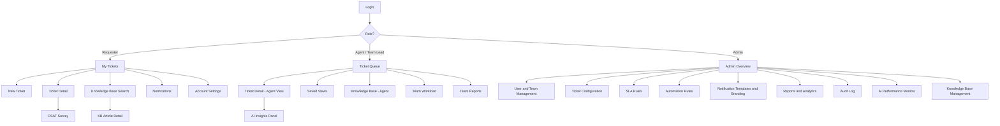
```mermaid
graph TD
    LOGIN[Login] --> ROLECHECK{Role?}
    ROLECHECK -->|Requester| CP_HOME[My Tickets]
    ROLECHECK -->|Agent / Team Lead| AC_HOME[Ticket Queue]
    ROLECHECK -->|Admin| AD_HOME[Admin Overview]

    CP_HOME --> CP_NEW[New Ticket]
    CP_HOME --> CP_DETAIL[Ticket Detail]
    CP_HOME --> CP_KB[Knowledge Base Search]
    CP_KB --> CP_ARTICLE[KB Article Detail]
    CP_DETAIL --> CP_CSAT[CSAT Survey]
    CP_HOME --> CP_NOTIF[Notifications]
    CP_HOME --> CP_PROFILE[Account Settings]

    AC_HOME --> AC_DETAIL[Ticket Detail - Agent View]
    AC_DETAIL --> AC_AI[AI Insights Panel]
    AC_HOME --> AC_VIEWS[Saved Views]
    AC_HOME --> AC_KB[Knowledge Base - Agent]
    AC_HOME --> AC_TEAM[Team Workload]
    AC_HOME --> AC_REPORT[Team Reports]

    AD_HOME --> AD_USERS[User and Team Management]
    AD_HOME --> AD_CONFIG[Ticket Configuration]
    AD_HOME --> AD_SLA[SLA Rules]
    AD_HOME --> AD_AUTO[Automation Rules]
    AD_HOME --> AD_NOTIFTPL[Notification Templates and Branding]
    AD_HOME --> AD_REPORT[Reports and Analytics]
    AD_HOME --> AD_AUDIT[Audit Log]
    AD_HOME --> AD_AIPERF[AI Performance Monitor]
    AD_HOME --> AD_KB[Knowledge Base Management]
```

---

## 3. Entry Points

- **Direct URL (no session)**: any protected route redirects to Login; the originally requested URL is preserved and restored after successful authentication.
- **Login page**: the primary first-touch screen for all three personas — there is no separate marketing landing page, since AgentDesk is an internal tool, not a public product.
- **Deep link from email**: notification emails (assignment, reply, SLA breach, ticket acknowledgment) link directly to the relevant Ticket Detail screen; if unauthenticated, the user is routed through Login first and then forwarded to that same ticket.
- **Deep link from Slack (future)**: same pattern as email, deferred until the Slack integration (PRD Nice to Have) is built.
- **Post-login landing**: role-determined, per Section 1 (My Tickets / Ticket Queue / Admin Overview) — there is no shared generic home screen across roles.

---

## 4. Auth Flow

Two provisioning paths exist, matching how the requirements document splits "Requester/Customer" from internal staff roles:

- **Requester self-service**: Sign Up → email verification → first login → brief onboarding (empty-state guidance, not a full tour) → My Tickets.
- **Agent / Team Lead / Admin**: accounts are provisioned by an Admin (per FR10.2); the new user receives an invite email to set their password → first login → role-based home. No self-registration path exists for staff roles.
- **Returning users**: Login → role check → role-based home.
- **Forgot password**: available from the Login screen for any role → reset email → reset confirmation → back to Login.
- **Session expiry**: mid-session token expiry shows the Session Expired screen rather than silently failing; re-authenticating returns the user to their exact previous screen and scroll state where feasible.

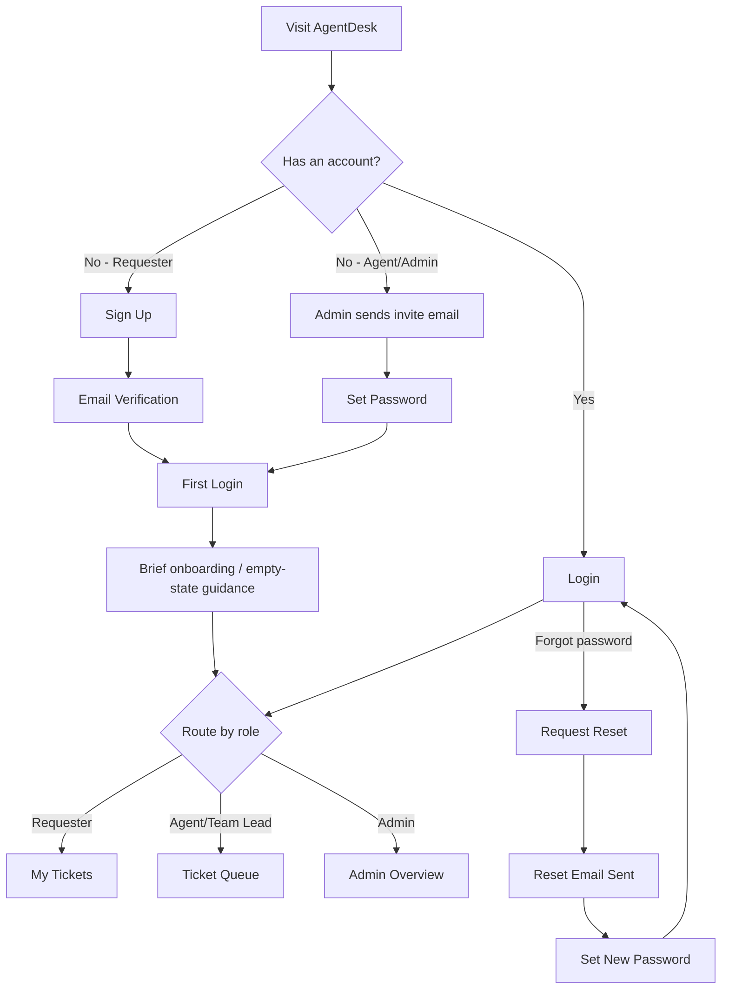
```mermaid
flowchart TD
    START[Visit AgentDesk] --> HASACC{Has an account?}
    HASACC -->|No - Requester| SIGNUP[Sign Up]
    SIGNUP --> VERIFY[Email Verification]
    VERIFY --> FIRSTLOGIN[First Login]
    HASACC -->|No - Agent/Admin| INVITE[Admin sends invite email]
    INVITE --> SETPW[Set Password]
    SETPW --> FIRSTLOGIN
    HASACC -->|Yes| LOGIN[Login]
    FIRSTLOGIN --> ONBOARD[Brief onboarding / empty-state guidance]
    ONBOARD --> ROLEDASH{Route by role}
    LOGIN --> ROLEDASH
    ROLEDASH -->|Requester| CPHOME[My Tickets]
    ROLEDASH -->|Agent/Team Lead| ACHOME[Ticket Queue]
    ROLEDASH -->|Admin| ADHOME[Admin Overview]

    LOGIN -->|Forgot password| RESETREQ[Request Reset]
    RESETREQ --> RESETEMAIL[Reset Email Sent]
    RESETEMAIL --> RESETCONFIRM[Set New Password]
    RESETCONFIRM --> LOGIN
```

---

## 5. Key User Journeys

### Journey 1 — Requester submits and tracks a ticket to resolution
1. Requester lands on **My Tickets**, clicks **New Ticket**.
2. Fills required fields (Subject, Description, Category, Priority); optionally attaches a file; sees suggested KB articles as they type (self-service deflection, per PRD Nice to Have).
3. Submits → sees a brief "AgentDesk is reviewing your ticket" processing state while the AI pipeline runs PII redaction, classification, and routing (Section 5 of the TRD).
4. Lands on the new **Ticket Detail** page showing the Ticket ID and status `New`.
5. Receives email + in-app notification when an agent replies; clicking either takes them straight back to Ticket Detail.
6. Once the agent marks the ticket Resolved, the requester sees a **CSAT Survey** modal on their next visit to that ticket.
7. Ticket transitions to `Closed`; the requester can still **Reopen** it if within the configurable reopen window.

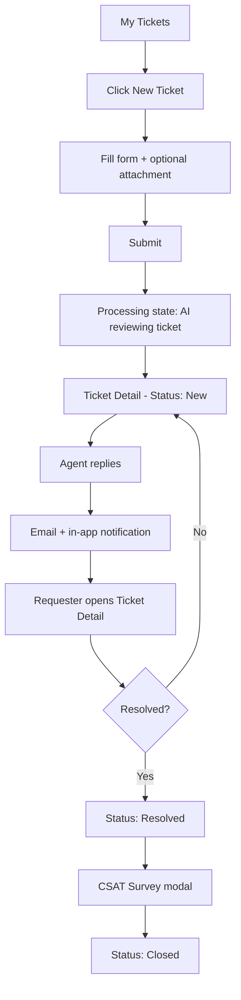
```mermaid
flowchart TD
    A[My Tickets] --> B[Click New Ticket]
    B --> C[Fill form + optional attachment]
    C --> D[Submit]
    D --> E[Processing state: AI reviewing ticket]
    E --> F[Ticket Detail - Status: New]
    F --> G[Agent replies]
    G --> H[Email + in-app notification]
    H --> I[Requester opens Ticket Detail]
    I --> J{Resolved?}
    J -->|No| F
    J -->|Yes| K[Status: Resolved]
    K --> L[CSAT Survey modal]
    L --> M[Status: Closed]
```

### Journey 2 — Agent resolves an AI-routed ticket
1. Agent opens **Ticket Queue**; a new ticket appears, already classified and routed by the AI pipeline.
2. Opens **Ticket Detail — Agent View**, checks the **AI Insights** tab (predicted category, priority, confidence score, similar past tickets).
3. If the AI pipeline produced a **draft response**, the agent opens the draft in a side drawer.
4. Agent **Approves** (sends as-is), **Edits then sends**, or **Rejects** and writes a manual reply — human-in-the-loop is mandatory at this step (per TRD Section 5).
5. Agent updates ticket status as work progresses (In Progress → Resolved).
6. If the ticket doesn't match any AI-suggested category confidently, the agent manually recategorizes instead — the low-confidence branch of the AI pipeline.

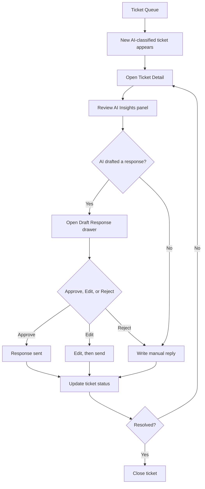
```mermaid
flowchart TD
    A[Ticket Queue] --> B[New AI-classified ticket appears]
    B --> C[Open Ticket Detail]
    C --> D[Review AI Insights panel]
    D --> E{AI drafted a response?}
    E -->|Yes| F[Open Draft Response drawer]
    F --> G{Approve, Edit, or Reject}
    G -->|Approve| H[Response sent]
    G -->|Edit| I[Edit, then send]
    G -->|Reject| J[Write manual reply]
    E -->|No| J
    H --> K[Update ticket status]
    I --> K
    J --> K
    K --> L{Resolved?}
    L -->|No| C
    L -->|Yes| M[Close ticket]
```

### Journey 3 — Admin configures an SLA/automation rule and monitors compliance
1. Admin opens **Admin Overview**, navigates to **SLA Rules**.
2. Creates or edits a policy (response/resolution targets per category + priority); save triggers an **Audit Log** entry.
3. Separately navigates to **Automation Rules**, defines a trigger → condition → action (e.g. "SLA nearing breach → escalate to Team Lead"), activates it.
4. Returns to **Admin Overview**, watches the SLA Compliance widget over time.
5. If a breach trend appears, drills into **Reports & Analytics** to investigate root cause (category, agent, time window).

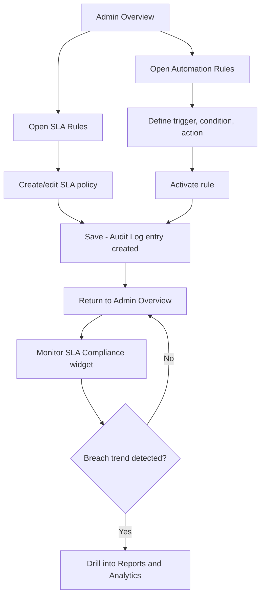
```mermaid
flowchart TD
    A[Admin Overview] --> B[Open SLA Rules]
    B --> C[Create/edit SLA policy]
    C --> D[Save - Audit Log entry created]
    A --> E[Open Automation Rules]
    E --> F[Define trigger, condition, action]
    F --> G[Activate rule]
    G --> D
    D --> H[Return to Admin Overview]
    H --> I[Monitor SLA Compliance widget]
    I --> J{Breach trend detected?}
    J -->|Yes| K[Drill into Reports and Analytics]
    J -->|No| H
```

---

## 6. Edge Cases — Empty, Error & Loading States

| Screen | Empty State | Error State | Loading State |
|---|---|---|---|
| My Tickets (Requester) | "You have no tickets yet" + Create your first ticket CTA | "Couldn't load your tickets" + Retry | Skeleton list rows |
| Ticket Queue (Agent) | "Queue is empty — nice work!" | "Couldn't load the queue" + Retry | Skeleton list rows |
| New Ticket form | — | Inline field validation errors; submission-failure banner if the request fails | "AgentDesk is reviewing your ticket…" processing state after submit |
| Ticket Detail | "No replies yet" placeholder in the thread | "AI classification unavailable — please categorize manually" fallback banner (AI service timeout) | Spinner while the thread/attachments load |
| Knowledge Base Search | "No articles found" + suggestion to submit a ticket instead | "Search is temporarily unavailable" | Skeleton article cards |
| Reports & Analytics | "No data for the selected range" | "Report generation failed" + Retry | Skeleton charts/tables |
| Notifications | "You're all caught up" | — | Skeleton list rows |
| Automation Rules | "No automation rules yet" + Add your first rule CTA | Inline validation errors on save (e.g. conflicting trigger) | Spinner while activating/saving a rule |
| Attachment upload | — | "File too large" / "Unsupported file type" (per configurable size limit, TRD Section 8) | Progress bar during upload |
| Session Expired (system) | — | Shown for any expired-token request | — |

---

## 7. Modal / Drawer / Overlay Interactions

| Trigger | Type | Purpose | Primary Actions |
|---|---|---|---|
| "New Ticket" (quick-create from Agent Console) | Modal | Let an agent log a ticket on a requester's behalf without leaving the queue | Submit / Cancel |
| Assign / Reassign | Modal | Pick an agent or queue for a ticket | Assign / Cancel |
| Merge tickets | Modal | Select the target ticket to merge into | Merge / Cancel |
| Escalate ticket | Confirmation modal | Confirm escalation to a Team Lead | Escalate / Cancel |
| AI Draft Response | Side drawer | Review, edit, or reject an AI-generated reply before sending (human-in-the-loop) | Approve / Edit / Reject |
| Attachment preview | Lightbox overlay | View an image/PDF without leaving the ticket | Close / Download |
| Deactivate user | Confirmation modal | Prevent accidental account removal | Deactivate / Cancel |
| CSAT survey | Modal | Capture satisfaction rating after closure | Submit / Dismiss |
| Notification preferences | Modal (or Settings tab) | Manage per-trigger, per-channel preferences | Save / Cancel |
| Session expired | Modal | Re-authenticate without losing the current destination | Log in again |

---

## 8. Redirect Logic

| Action / Event | Destination |
|---|---|
| Successful login | Role-based home (My Tickets / Ticket Queue / Admin Overview) |
| Logout | Login screen |
| Signup + email verification complete | First login → onboarding → My Tickets |
| Ticket created | New Ticket Detail page, with the AI-processing banner shown |
| Click a notification | Deep link to the relevant Ticket Detail or KB Article |
| Ticket merged | Redirect from the source ticket to the target ticket's detail page |
| Ticket resolved (requester's next visit) | CSAT modal shown over Ticket Detail |
| Unauthorized route access (e.g. Agent → Admin URL) | Redirect to the user's own role home + "Access restricted" toast |
| Session/token expiry mid-action | Session Expired modal → Login → return to the original destination |
| Password reset link clicked | Reset Confirmation page → success → Login screen |
| Admin saves a configuration change | Stay on the same configuration screen; success toast; Audit Log updated |
| Delete / deactivate confirmed | Return to the Users/Teams list, item shown as removed or greyed out |

---

## 9. Role-Based Access Notes

- **Requesters** cannot reach any Agent Console or Admin Dashboard route; direct URL attempts redirect to My Tickets with a restricted-access toast.
- **Agents** cannot access Admin configuration screens (matching Acceptance Criteria AC3 in the requirements document: *"An Agent cannot access Admin configuration settings"*) — attempts redirect to Ticket Queue.
- **Team Leads** get everything an Agent has, plus Team Workload and Team Reports; they still cannot reach org-wide Admin configuration.
- **Admins** have access to all screens across all three portals for support/testing purposes during the prototype phase.

---

## 10. Ticket Lifecycle State Machine

The requirements document specifies configurable statuses (New, Open, In Progress, On Hold, Resolved, Closed, Reopened, per FR4.1). This section defines the complete state machine — every allowed transition, who can trigger it, what's automatic vs. manual, and how it drives SLA timers, audit logging, and notifications.

| Transition | Trigger Type | Who Can Perform It | SLA Timer Effect | Notification Fired |
|---|---|---|---|---|
| — → New | Automatic | System (ticket submitted via portal/email/chat) | Response timer starts; Resolution timer starts | Acknowledgment email to requester |
| New → Open | Automatic (AI pipeline completes routing) or Manual | System, or Agent/Admin override | No change | Assignment notification to agent |
| Open → In Progress | Manual | Agent | Response timer stops on first reply | None (unless first reply itself triggers a "replied" notification) |
| In Progress → On Hold | Manual | Agent | Resolution timer **pauses** | Requester notified ("we're waiting on info from you") |
| On Hold → In Progress | Automatic (requester replies) or Manual (agent resumes) | System or Agent | Resolution timer **resumes** | Agent notified of requester reply |
| In Progress → Resolved | Manual | Agent | Resolution timer stops | Requester notified; CSAT survey queued |
| Resolved → Closed | Automatic (grace period elapses, e.g. 3 days with no reopen) or Manual | System, or Agent/Admin | No change — SLA already recorded | None additional |
| Closed → Reopened | Manual, within configurable window | Requester (self-service) or Agent/Admin | A **fresh** resolution timer starts, tracked as a separate SLA segment for reporting accuracy | Original agent/team notified |
| Reopened → In Progress | Automatic | System | Resolution timer (new segment) continues | Agent notified of reopened ticket |

Every transition — automatic or manual — is written to `AUDIT_LOGS` with actor (system or user ID), previous status, new status, and timestamp, per TRD Section 10.

**When status changes occur**: submission always creates `New`; the AI pipeline's routing decision (Section 5 of the TRD) is what actually moves a ticket to `Open` once it lands in a queue or on an agent — this is why New → Open is automatic by default rather than requiring an agent to manually "accept" every ticket.
**What happens after reopening**: a reopened ticket does not inherit its original SLA clock. It gets a new resolution-timer segment so that SLA compliance reporting can distinguish "resolved within original SLA" from "required a second pass" — this keeps the metrics in Section 12 of the TRD honest rather than averaging away repeated work.

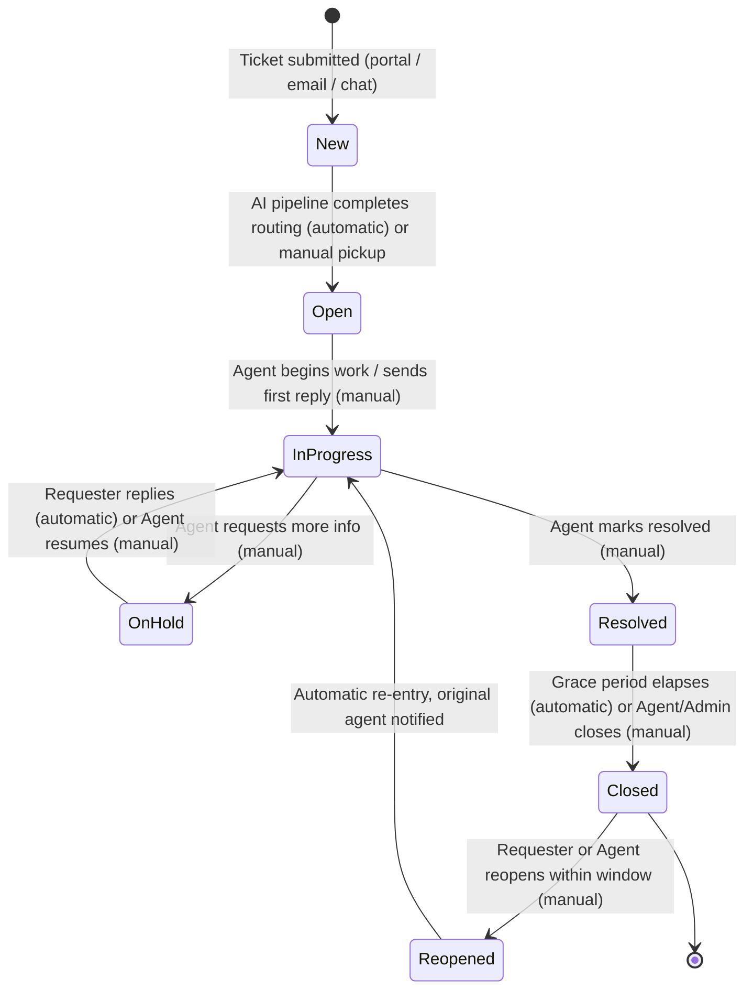
```mermaid
stateDiagram-v2
    [*] --> New: Ticket submitted (portal / email / chat)
    New --> Open: AI pipeline completes routing (automatic) or manual pickup
    Open --> InProgress: Agent begins work / sends first reply (manual)
    InProgress --> OnHold: Agent requests more info (manual)
    OnHold --> InProgress: Requester replies (automatic) or Agent resumes (manual)
    InProgress --> Resolved: Agent marks resolved (manual)
    Resolved --> Closed: Grace period elapses (automatic) or Agent/Admin closes (manual)
    Closed --> Reopened: Requester or Agent reopens within window (manual)
    Reopened --> InProgress: Automatic re-entry, original agent notified
    Closed --> [*]
```

---

## 11. Email-to-Ticket Flow

FR1.1 and FR12.1 call out email as both a ticket-creation channel and an ongoing integration point. This flow shows the complete journey from an inbound email to a live ticket the requester can keep working from either channel.

1. Customer sends an email to the support address.
2. The email server (IMAP/SMTP, per TRD Section 3) receives the message.
3. The Email Parser extracts sender, subject, body, and attachments.
4. If the message is malformed (empty body, unreadable encoding, spoofed headers), it's routed to a manual review queue rather than silently dropped or silently converted into a broken ticket.
5. Attachments are extracted and validated the same way as portal uploads (Section 13).
6. Before anything reaches classification, the system checks whether this message is a **reply to an existing ticket** (matched by thread reference, subject-line ticket ID, or sender + recent-activity heuristics). If it matches, the content is appended as a new comment on the existing ticket rather than creating a duplicate.
7. If it's genuinely new, the content goes through PII redaction, then the AI classification/routing pipeline (TRD Section 5), same as a portal-submitted ticket.
8. A ticket is created and an acknowledgment email is sent back, including the Ticket ID in the subject line (used for future thread-matching).
9. The requester can continue the conversation either by replying to that email thread or by logging into the Customer Portal — both update the same ticket.

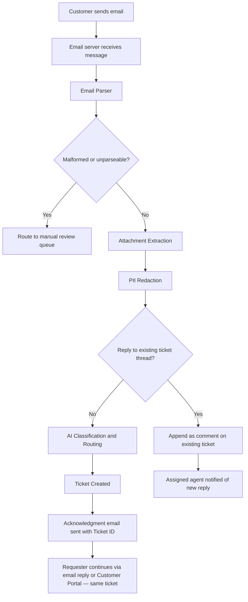
```mermaid
flowchart TD
    A[Customer sends email] --> B[Email server receives message]
    B --> C[Email Parser]
    C --> D{Malformed or unparseable?}
    D -->|Yes| E[Route to manual review queue]
    D -->|No| F[Attachment Extraction]
    F --> G[PII Redaction]
    G --> H{Reply to existing ticket thread?}
    H -->|Yes| I[Append as comment on existing ticket]
    H -->|No| J[AI Classification and Routing]
    J --> K[Ticket Created]
    K --> L[Acknowledgment email sent with Ticket ID]
    I --> M[Assigned agent notified of new reply]
    L --> N[Requester continues via email reply or Customer Portal — same ticket]
```

---

## 12. Chat Widget Flow

FR1.1 also names the chat widget as an intake channel. Unlike email and the portal form, chat starts as a conversation and only becomes a ticket if self-service doesn't resolve the issue — this is the deflection mechanism referenced as a Nice to Have in the PRD.

1. Requester opens the chat widget from the Customer Portal.
2. The AI chatbot greets them and asks what they need help with.
3. As the requester describes the issue, the bot surfaces relevant Knowledge Base articles in-line (same suggestion mechanism used on the New Ticket form).
4. If the requester confirms the problem is solved, the conversation simply ends — no ticket is created, and this is logged as a deflection for the AI Performance Monitor.
5. If it isn't solved — either the requester says so, or the bot exhausts its suggestions — the conversation is converted into a ticket. The full chat transcript becomes the ticket's initial conversation history (stored via `CONVERSATION_HISTORY`, per TRD Section 4), so the agent doesn't need the requester to repeat themselves.
6. The converted ticket runs through the same AI pipeline (PII redaction, classification, routing) as any other channel, then routes to an agent.
7. **Human takeover**: if an agent is available and the requester is still active in the widget, the agent can join the live chat directly; otherwise the conversation continues asynchronously through the normal Ticket Detail thread.

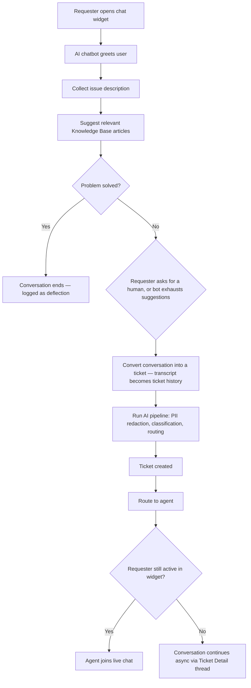
```mermaid
flowchart TD
    A[Requester opens chat widget] --> B[AI chatbot greets user]
    B --> C[Collect issue description]
    C --> D[Suggest relevant Knowledge Base articles]
    D --> E{Problem solved?}
    E -->|Yes| F[Conversation ends — logged as deflection]
    E -->|No| G{Requester asks for a human, or bot exhausts suggestions}
    G --> H[Convert conversation into a ticket — transcript becomes ticket history]
    H --> I[Run AI pipeline: PII redaction, classification, routing]
    I --> J[Ticket created]
    J --> K[Route to agent]
    K --> L{Requester still active in widget?}
    L -->|Yes| M[Agent joins live chat]
    L -->|No| N[Conversation continues async via Ticket Detail thread]
```

---

## 13. Attachment Upload Flow

Expands the attachment handling referenced in Section 6 (Edge Cases) and Section 7 (Modal Interactions), covering the full upload journey during ticket creation (FR1.4).

1. Requester/agent selects a file to attach.
2. The system checks the file extension/MIME type against the configured allowlist (TRD Section 8).
3. If unsupported, an inline error is shown and the file is removed from the upload queue — the rest of the ticket form remains untouched.
4. If supported, the file size is checked against the configurable limit (set by Admin, per Section 3.12 of the requirements document).
5. If oversized, an inline error names the configured limit and the file is removed from the queue.
6. Otherwise, the upload begins with a visible progress bar.
7. On success, the file is stored and a thumbnail/preview is generated.
8. The user can remove a file from the queue before submitting, or replace it by re-selecting a new file into the same slot.
9. On ticket submission, all successfully uploaded attachments are linked to the new ticket record.

**Failure handling**: a dropped connection mid-upload shows a retry option rather than silently failing; retrying resumes from the upload step without forcing the user to reselect the file if the browser session is still valid.

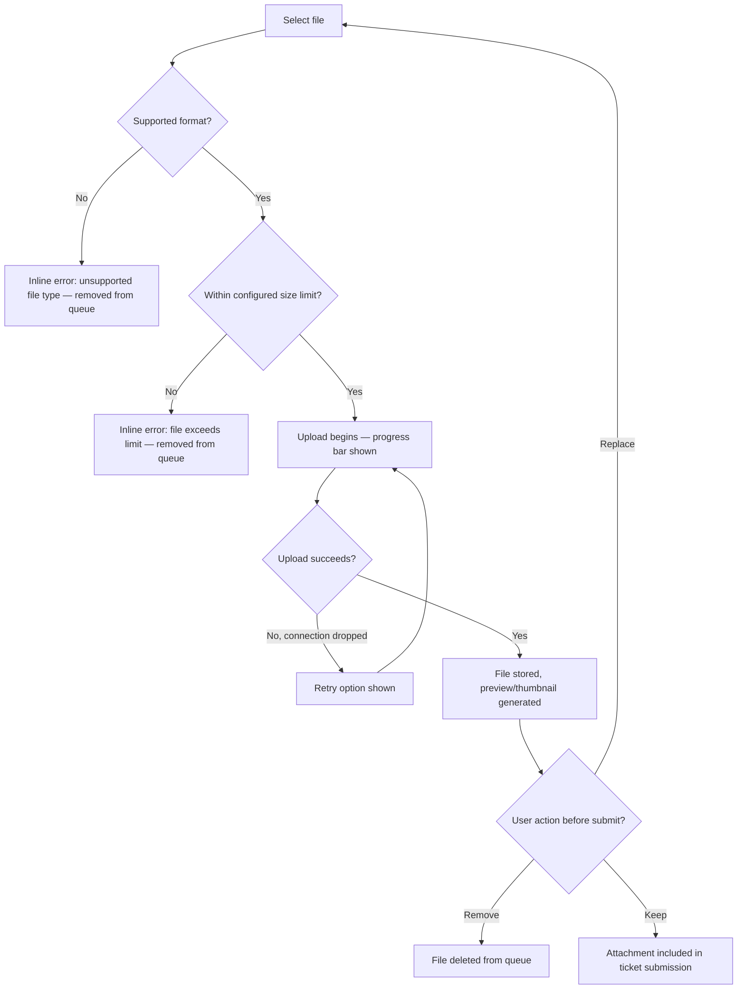
```mermaid
flowchart TD
    A[Select file] --> B{Supported format?}
    B -->|No| C[Inline error: unsupported file type — removed from queue]
    B -->|Yes| D{Within configured size limit?}
    D -->|No| E[Inline error: file exceeds limit — removed from queue]
    D -->|Yes| F[Upload begins — progress bar shown]
    F --> G{Upload succeeds?}
    G -->|No, connection dropped| H[Retry option shown]
    H --> F
    G -->|Yes| I[File stored, preview/thumbnail generated]
    I --> J{User action before submit?}
    J -->|Remove| K[File deleted from queue]
    J -->|Replace| A
    J -->|Keep| L[Attachment included in ticket submission]
```

---

## 14. AI Confidence Branch (Expanded Decision Flow)

Journey 2 (Section 5) mentions the low-confidence branch briefly. This section expands it into the full decision flow every ticket passes through after classification, since it's the single most important AI-first behavior in the product.

- **High confidence** *(illustrative threshold: ≥85%, to be recalibrated against real historical data, consistent with the PRD's approach to success metrics)*: the ticket is auto-routed to the predicted category/queue with no agent involvement at the classification step.
- **Medium confidence** *(illustrative threshold: 60–84%)*: the system suggests a category rather than committing to it; the assigned agent sees the suggestion in the AI Insights panel and confirms or corrects it before routing finalizes.
- **Low confidence** *(illustrative threshold: below 60%)*: the ticket is routed to manual classification — an agent must assign category and priority themselves, with no AI suggestion pre-filled beyond similar-ticket references from vector retrieval.
- **Feedback loop**: any agent correction (in the Medium or Low path) is stored against the ticket's classification record and flagged as training feedback — this is what feeds future model improvement, per the AI Performance Monitor in the Admin Dashboard.

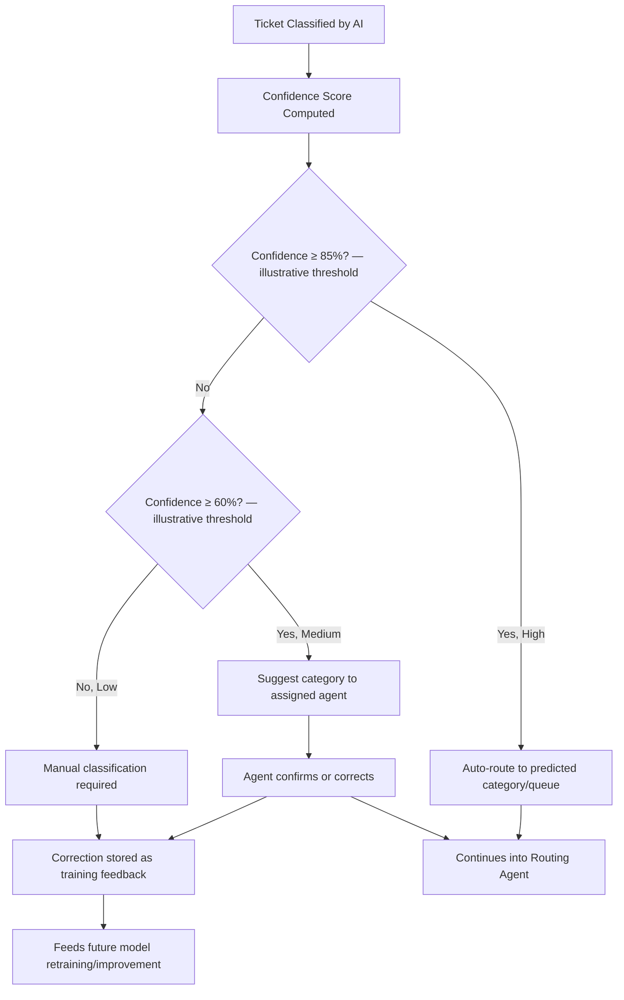
```mermaid
flowchart TD
    A[Ticket Classified by AI] --> B[Confidence Score Computed]
    B --> C{Confidence ≥ 85%? — illustrative threshold}
    C -->|Yes, High| D[Auto-route to predicted category/queue]
    C -->|No| E{Confidence ≥ 60%? — illustrative threshold}
    E -->|Yes, Medium| F[Suggest category to assigned agent]
    F --> G[Agent confirms or corrects]
    E -->|No, Low| H[Manual classification required]
    G --> I[Correction stored as training feedback]
    H --> I
    I --> J[Feeds future model retraining/improvement]
    D --> K[Continues into Routing Agent]
    G --> K
```

---

## 15. Automation Engine Runtime Flow

Section 14 of the TRD defines the automation engine's data model; this section shows how a rule actually executes once a ticket event fires, and how conflicts between multiple matching rules are resolved.

1. A trigger event occurs (ticket created, status changed, SLA nearing breach, tag added, etc.).
2. The Automation Engine fetches all **active** rules registered for that trigger type, ordered by priority.
3. Each rule's condition is evaluated against the ticket; non-matching rules are skipped (and, if the rule is disabled entirely, it's excluded from evaluation altogether rather than evaluated and discarded).
4. Matching rules execute their configured action(s): Assign, Notify, Escalate, Tag, etc.
5. **Multiple rule execution**: if more than one active rule matches the same event, actions apply in priority order; a later, lower-priority rule can still add complementary actions (e.g. rule 1 assigns a queue, rule 2 adds a tag) without conflict.
6. **Conflict handling**: if two rules attempt contradictory actions (e.g. assigning the same ticket to two different agents), the higher-priority rule's action wins, and the conflict is written to the Audit Log so an Admin can review and adjust rule priority.
7. Every executed action — and every skipped/conflicting rule — is recorded in `AUDIT_LOGS`.

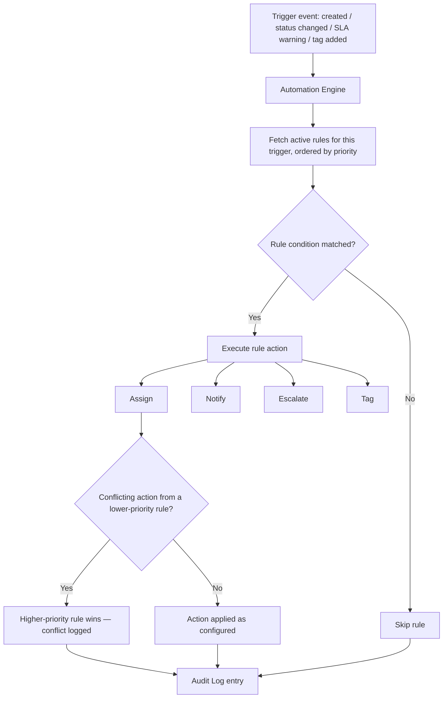
```mermaid
flowchart TD
    A[Trigger event: created / status changed / SLA warning / tag added] --> B[Automation Engine]
    B --> C[Fetch active rules for this trigger, ordered by priority]
    C --> D{Rule condition matched?}
    D -->|No| E[Skip rule]
    D -->|Yes| F[Execute rule action]
    F --> G[Assign]
    F --> H[Notify]
    F --> I[Escalate]
    F --> J[Tag]
    G --> K{Conflicting action from a lower-priority rule?}
    K -->|Yes| L[Higher-priority rule wins — conflict logged]
    K -->|No| M[Action applied as configured]
    L --> N[Audit Log entry]
    M --> N
    E --> N
```

---

## 16. SLA Lifecycle Flow

Runtime behavior for FR6.1–FR6.4, tying together the ticket lifecycle (Section 10) with SLA timers.

1. Ticket is created → response timer and resolution timer both start.
2. First agent reply stops the response timer.
3. If the ticket enters `On Hold`, the resolution timer **pauses** — time spent waiting on the requester doesn't count against the agent.
4. When the resolution timer crosses a warning threshold, a warning notification fires to the assigned agent.
5. If the ticket remains unresolved past a further threshold, it escalates and the relevant manager/Team Lead is notified.
6. Once resolved, both timers stop and the outcome (met/breached, and by how much) is recorded for reporting.
7. If the ticket is later reopened, a **new** resolution-timer segment begins rather than resuming the original clock, consistent with Section 10.

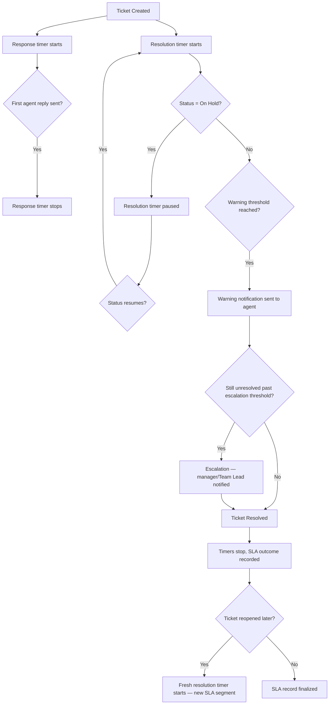
```mermaid
flowchart TD
    A[Ticket Created] --> B[Response timer starts]
    A --> C[Resolution timer starts]
    B --> D{First agent reply sent?}
    D -->|Yes| E[Response timer stops]
    C --> F{Status = On Hold?}
    F -->|Yes| G[Resolution timer paused]
    G --> H{Status resumes?}
    H -->|Yes| C
    F -->|No| I{Warning threshold reached?}
    I -->|Yes| J[Warning notification sent to agent]
    J --> K{Still unresolved past escalation threshold?}
    K -->|Yes| L[Escalation — manager/Team Lead notified]
    K -->|No| M[Ticket Resolved]
    L --> M
    M --> N[Timers stop, SLA outcome recorded]
    N --> O{Ticket reopened later?}
    O -->|Yes| P[Fresh resolution timer starts — new SLA segment]
    O -->|No| Q[SLA record finalized]
```

---

## 17. Notification Flow (Runtime Architecture)

Expands Section 7 of the TRD into the actual runtime path a notification event takes, tying triggers to channels to redirect behavior.

**Triggers**: ticket assignment, reply, status change, SLA warning, escalation, @mention, ticket closed, automation rule executed.

1. A qualifying event occurs anywhere in the system (Ticket Module, Workflow Engine, SLA Service, or Automation Engine).
2. The event is handed to the Notification Service.
3. The service checks the recipient's per-trigger, per-channel preferences (`/notifications/preferences`) to determine which channels to use.
4. Delivery fans out to Email and/or In-App (Slack and Teams once those integrations land — Section 29).
5. When the user clicks the notification (in any channel), they're redirected straight to the relevant destination — usually the Ticket Detail screen, occasionally a KB article (e.g. "new article published in a category you follow," future scope).

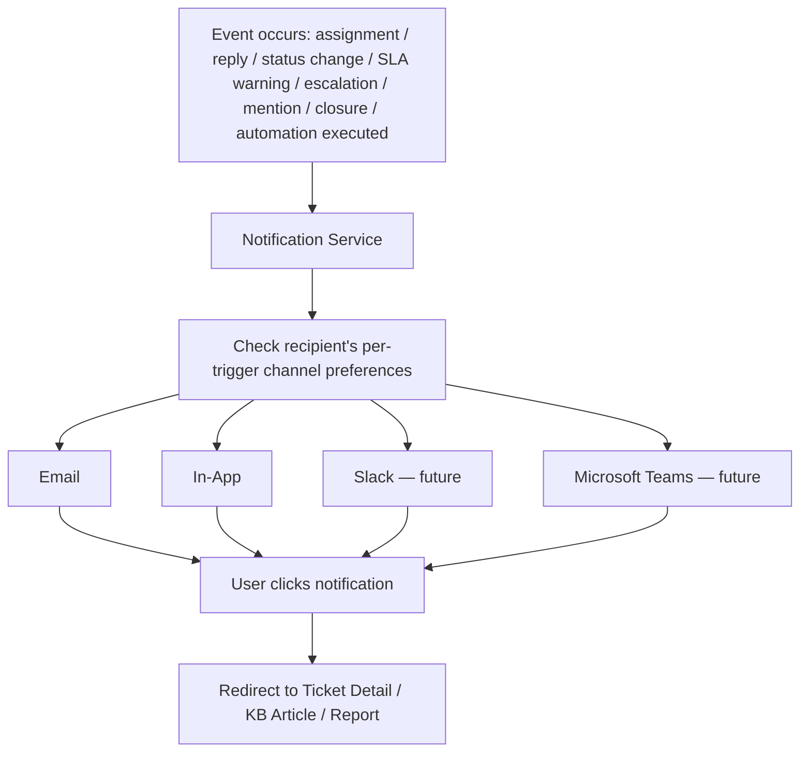
```mermaid
flowchart TD
    A[Event occurs: assignment / reply / status change / SLA warning / escalation / mention / closure / automation executed] --> B[Notification Service]
    B --> C[Check recipient's per-trigger channel preferences]
    C --> D[Email]
    C --> E[In-App]
    C --> F[Slack — future]
    C --> G[Microsoft Teams — future]
    D --> H[User clicks notification]
    E --> H
    F --> H
    G --> H
    H --> I[Redirect to Ticket Detail / KB Article / Report]
```

---

## 18. Search User Journeys by Role

Expands TRD Section 6 (hybrid FTS + vector search) into how the same search experience differs by who's using it.

- **Requester**: search is scoped to their own tickets plus the public Knowledge Base only. They never see other requesters' tickets or internal notes.
- **Agent / Team Lead**: search covers every ticket they have queue visibility into (their team, plus anything directly assigned to them), including internal notes, tags, and both published and draft Knowledge Base articles they're permitted to see.
- **Admin**: search is org-wide — every ticket regardless of team, all internal notes, the Audit Log, and the full Knowledge Base including drafts.

All three follow the same underlying mechanism — query → hybrid search engine (Postgres FTS + `pg_trgm` + `pgvector`) → ranked results across subject, description, comments, tags, attachment metadata, and Knowledge Base content — with the scope simply narrowed by role before ranking.

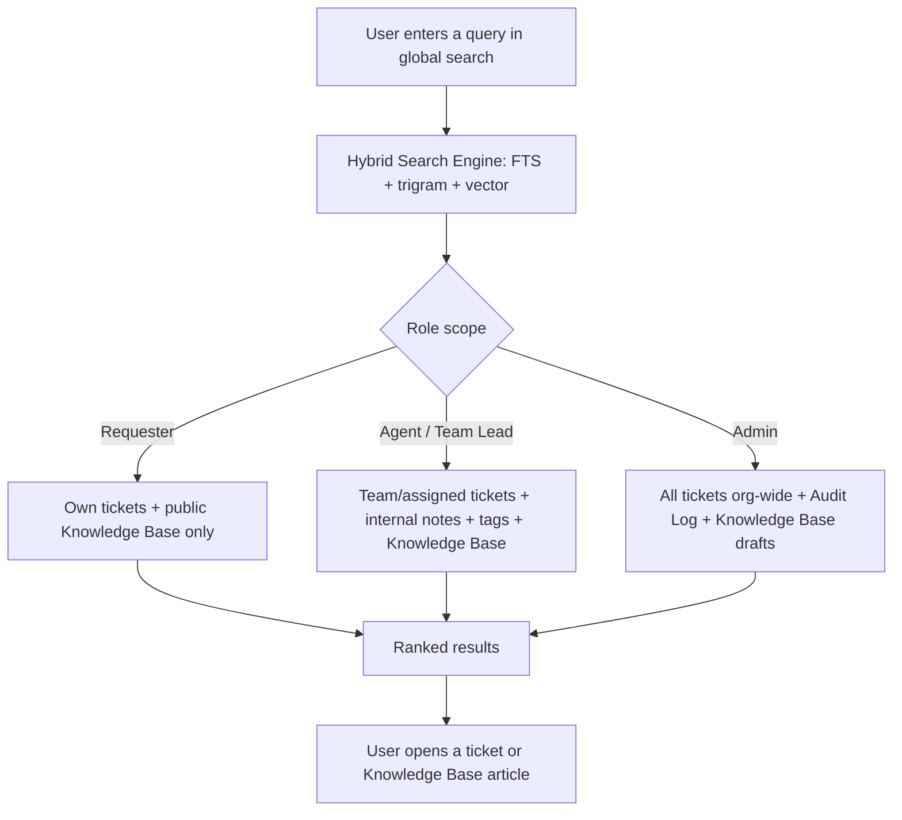
```mermaid
flowchart TD
    A[User enters a query in global search] --> B[Hybrid Search Engine: FTS + trigram + vector]
    B --> C{Role scope}
    C -->|Requester| D[Own tickets + public Knowledge Base only]
    C -->|Agent / Team Lead| E[Team/assigned tickets + internal notes + tags + Knowledge Base]
    C -->|Admin| F[All tickets org-wide + Audit Log + Knowledge Base drafts]
    D --> G[Ranked results]
    E --> G
    F --> G
    G --> H[User opens a ticket or Knowledge Base article]
```

---

## 19. Knowledge Base Creation Loop

Shows how the optional Knowledge Base module (Section 3.8 of the requirements document) is fed by resolved tickets, closing the loop referenced in the PRD's Nice to Have list.

1. A ticket is marked `Resolved`.
2. The agent is prompted (optionally, not mandatorily) to flag the resolution as reusable if it addressed a recurring or generically useful issue.
3. If flagged, a draft Knowledge Base article is created, pre-filled from the ticket's subject and resolution content.
4. An Admin (or a senior Agent with KB permissions) reviews the draft — editing as needed.
5. Once approved, the article is published and becomes immediately searchable (Section 18).
6. Published articles are then eligible to be suggested during future ticket creation and in the chat widget (Sections 12 and the New Ticket screen), completing the deflection loop.

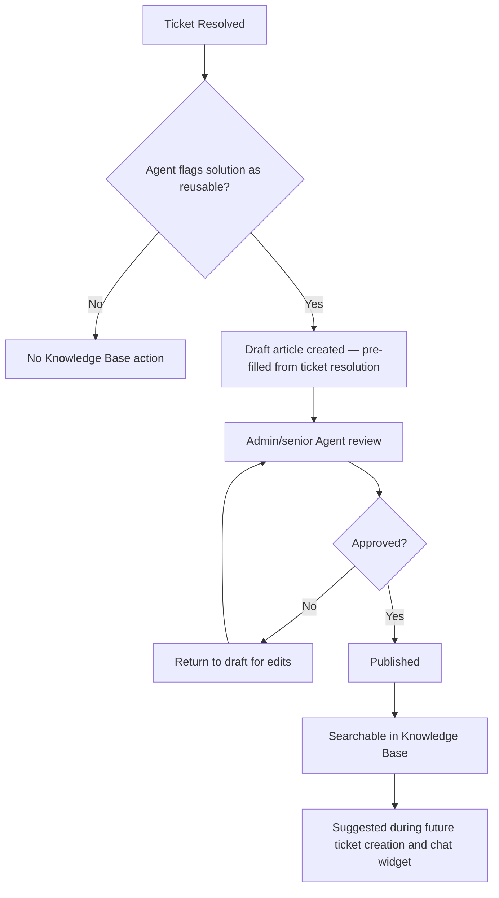
```mermaid
flowchart TD
    A[Ticket Resolved] --> B{Agent flags solution as reusable?}
    B -->|No| C[No Knowledge Base action]
    B -->|Yes| D[Draft article created — pre-filled from ticket resolution]
    D --> E[Admin/senior Agent review]
    E --> F{Approved?}
    F -->|No| G[Return to draft for edits]
    G --> E
    F -->|Yes| H[Published]
    H --> I[Searchable in Knowledge Base]
    I --> J[Suggested during future ticket creation and chat widget]
```

---

## 20. Ticket Merge Flow (Expanded)

Expands the Merge modal from Section 7 into the full journey, including rollback, per FR4.3.

1. A duplicate is suspected — either flagged automatically (near-identical subject/description via vector similarity) or noticed manually by an agent.
2. The agent selects the candidate tickets to compare.
3. A side-by-side comparison view shows both threads.
4. The agent chooses which ticket is primary.
5. On merge, the secondary ticket's conversation history is appended to the primary's thread, and the secondary is set to a `Merged` state (a variant of `Closed`) linked back to the primary.
6. The agent is redirected to the primary ticket, which now reflects the combined history.
7. The merge is written to the Audit Log with both ticket IDs.
8. **Rollback**: if a merge was performed in error, an Admin (or the merging agent, within a short window) can reverse it — splitting the appended history back onto the original secondary ticket, itself logged as a distinct audit event rather than silently undoing the first.

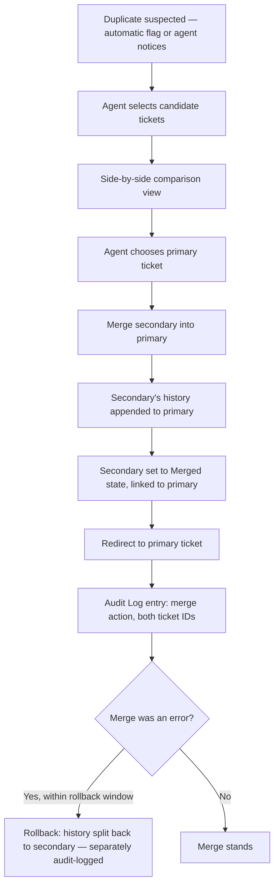
```mermaid
flowchart TD
    A[Duplicate suspected — automatic flag or agent notices] --> B[Agent selects candidate tickets]
    B --> C[Side-by-side comparison view]
    C --> D[Agent chooses primary ticket]
    D --> E[Merge secondary into primary]
    E --> F[Secondary's history appended to primary]
    F --> G[Secondary set to Merged state, linked to primary]
    G --> H[Redirect to primary ticket]
    H --> I[Audit Log entry: merge action, both ticket IDs]
    I --> J{Merge was an error?}
    J -->|Yes, within rollback window| K[Rollback: history split back to secondary — separately audit-logged]
    J -->|No| L[Merge stands]
```

---

## 21. Queue Management Flow

Runtime movement of a ticket through queue states, expanding FR3.4 (queue/department grouping).

1. A new ticket enters its assigned queue as **Unassigned**.
2. Routing (manual or automated, per TRD Section 2) makes it **Assigned** to a specific agent.
3. If reassignment is needed, the ticket is **Transferred** to another agent or queue and re-enters the Assigned state under its new owner.
4. If it needs senior attention, it's **Escalated** — visible separately in Team Workload (Section 1) — and returns to Assigned once picked up by the escalation target.
5. Once work concludes, it moves to **Resolved**, then to **Archived** after the configured retention period post-Closed.

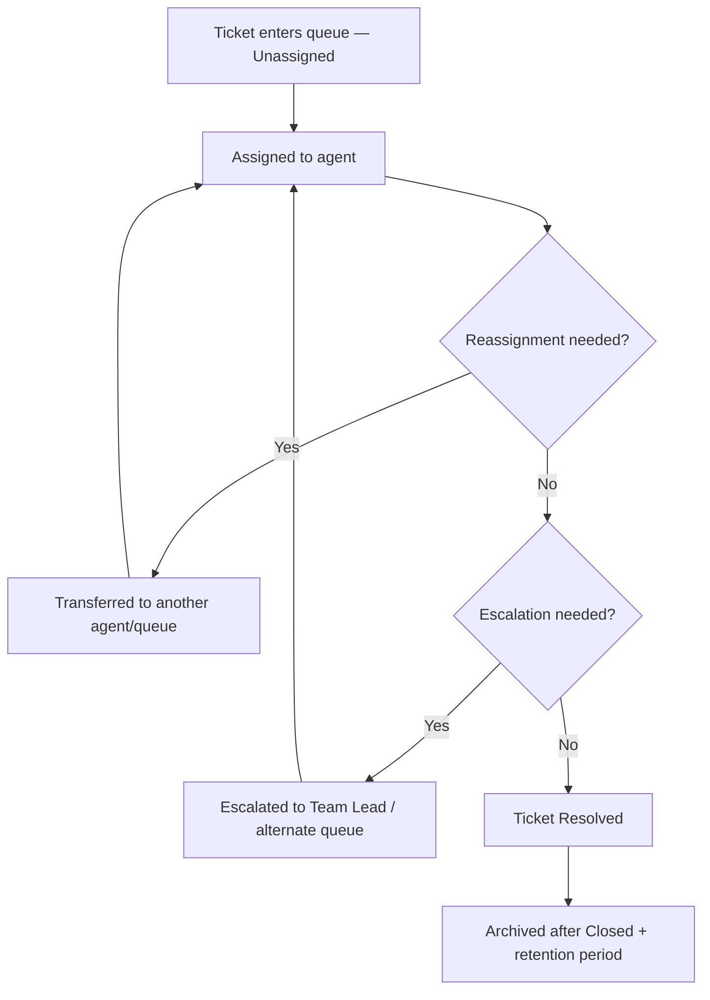
```mermaid
flowchart TD
    A[Ticket enters queue — Unassigned] --> B[Assigned to agent]
    B --> C{Reassignment needed?}
    C -->|Yes| D[Transferred to another agent/queue]
    D --> B
    C -->|No| E{Escalation needed?}
    E -->|Yes| F[Escalated to Team Lead / alternate queue]
    F --> B
    E -->|No| G[Ticket Resolved]
    G --> H[Archived after Closed + retention period]
```

---

## 22. Attachment Preview Flow (Post-Upload Interaction)

Expands the Attachment Preview overlay from Section 7 into full interaction behavior, including permissions.

1. Once uploaded (Section 13), an attachment shows an inline preview — a thumbnail for images, an embedded viewer for PDFs.
2. From the preview, a user can **download** the original file.
3. **Replace** and **delete** are permission-gated: only the original uploader, an assigned agent, or an Admin can perform these — a different requester (on a shared ticket, if that's ever supported) or an uninvolved agent cannot.
4. A replace operation keeps the prior file as a version rather than silently discarding it, so ticket history stays auditable.
5. A delete operation is logged to the Audit Log, same as any other ticket-content change.

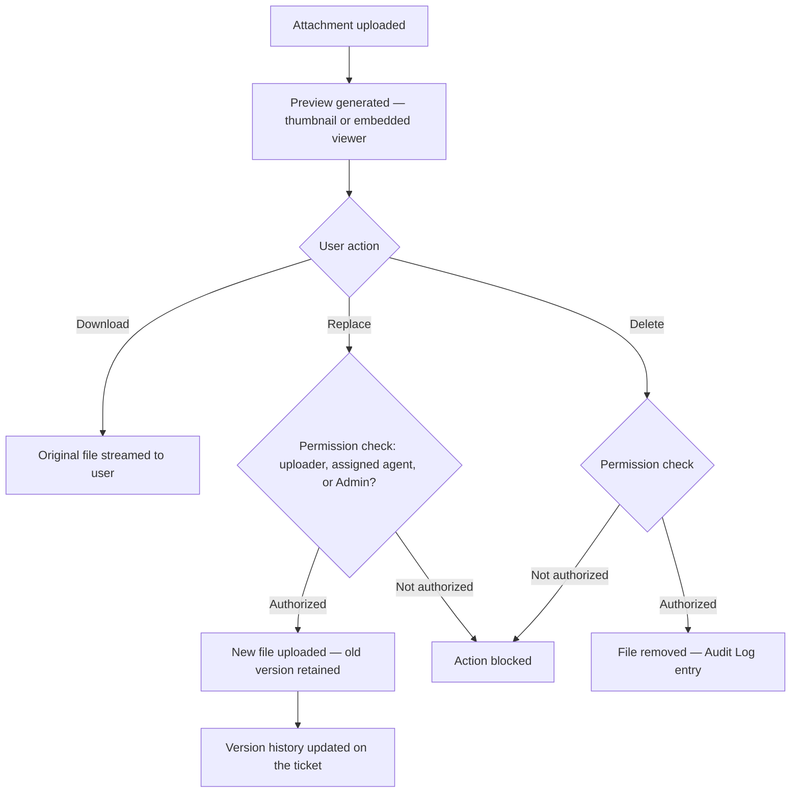
```mermaid
flowchart TD
    A[Attachment uploaded] --> B[Preview generated — thumbnail or embedded viewer]
    B --> C{User action}
    C -->|Download| D[Original file streamed to user]
    C -->|Replace| E{Permission check: uploader, assigned agent, or Admin?}
    E -->|Authorized| F[New file uploaded — old version retained]
    E -->|Not authorized| G[Action blocked]
    C -->|Delete| H{Permission check}
    H -->|Authorized| I[File removed — Audit Log entry]
    H -->|Not authorized| G
    F --> J[Version history updated on the ticket]
```

---

## 23. Reporting Workflow

Expands FR9.1–FR9.4 into the full Admin journey through Reports & Analytics.

1. Admin opens **Reports & Analytics**.
2. Chooses a report type (SLA compliance, agent productivity, ticket trends, category analytics, AI performance).
3. Applies filters (category, priority, agent, team) and a custom date range.
4. Generates the report.
5. If no data matches the filters/range, an empty state is shown rather than a blank chart.
6. If the dataset is large, the dashboard paginates/aggregates and shows a background-generation notice rather than blocking the UI.
7. Once rendered, the Admin can export to CSV, PDF, or Excel.
8. If generation fails outright (e.g. a query timeout), an error state with Retry is shown, consistent with Section 6's edge-case conventions.

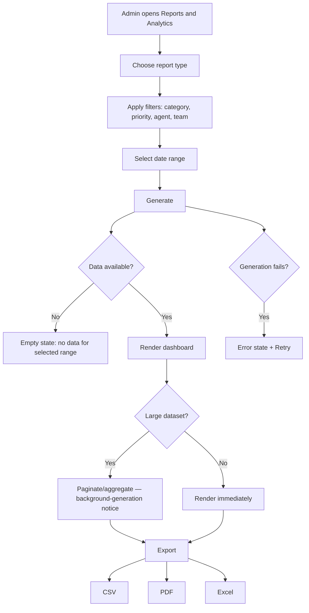
```mermaid
flowchart TD
    A[Admin opens Reports and Analytics] --> B[Choose report type]
    B --> C[Apply filters: category, priority, agent, team]
    C --> D[Select date range]
    D --> E[Generate]
    E --> F{Data available?}
    F -->|No| G[Empty state: no data for selected range]
    F -->|Yes| H[Render dashboard]
    H --> I{Large dataset?}
    I -->|Yes| J[Paginate/aggregate — background-generation notice]
    I -->|No| K[Render immediately]
    J --> L[Export]
    K --> L
    L --> M[CSV]
    L --> N[PDF]
    L --> O[Excel]
    E --> P{Generation fails?}
    P -->|Yes| Q[Error state + Retry]
```

---

## 24. User Management Flow

Expands FR10.1–FR10.2 into the full Admin journey for provisioning and maintaining accounts.

1. Admin creates a new user.
2. Assigns a role (Requester accounts are typically self-registered, so this path is mainly for Agent/Team Lead/Admin).
3. Assigns a team.
4. An invite email is sent.
5. The new user sets their password.
6. They log in for the first time and see a brief onboarding (per Section 4).
7. Account is now active/ready.

Beyond initial provisioning, Admins can:
- **Deactivate** an account — the user can no longer log in, and any tickets assigned to them are flagged for reassignment.
- **Reactivate** a previously deactivated account — it regains its prior role and team.
- **Change role** — takes effect on the user's next request (their current session's permissions are re-checked against the new role).
- **Change team** — updates which queues/tickets the user has visibility into.

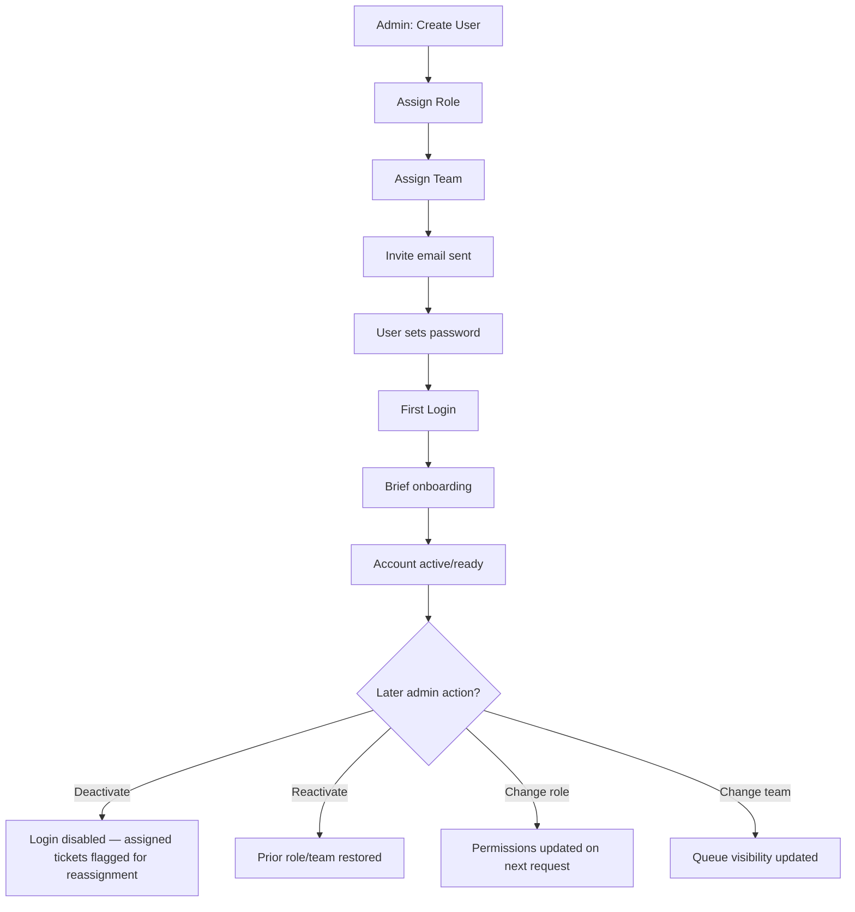
```mermaid
flowchart TD
    A[Admin: Create User] --> B[Assign Role]
    B --> C[Assign Team]
    C --> D[Invite email sent]
    D --> E[User sets password]
    E --> F[First Login]
    F --> G[Brief onboarding]
    G --> H[Account active/ready]
    H --> I{Later admin action?}
    I -->|Deactivate| J[Login disabled — assigned tickets flagged for reassignment]
    I -->|Reactivate| K[Prior role/team restored]
    I -->|Change role| L[Permissions updated on next request]
    I -->|Change team| M[Queue visibility updated]
```

---

## 25. Automation Builder Flow

Distinct from the runtime execution in Section 15 — this is the Admin's configuration-time journey for creating a rule in the first place (FR13.2).

1. Admin opens **Automation Rules** and starts a new rule.
2. Chooses a trigger (ticket created, status changed, SLA warning, tag added, etc.).
3. Chooses one or more conditions (category equals X, priority is Critical, requester is VIP, ticket idle for N hours).
4. Chooses one or more actions (assign, notify, escalate, tag).
5. Previews the rule — showing a sample of existing tickets that would have matched, so the Admin can sanity-check it before activating.
6. Saves the rule.
7. Activates it, making it live for the runtime engine (Section 15).
8. The creation and activation are both recorded in the Audit Log.

```mermaid
flowchart TD
    A[Admin opens Automation Rules] --> B[Create Rule]
    B --> C[Choose Trigger]
    C --> D[Choose Conditions]
    D --> E[Choose Actions]
    E --> F[Preview — sample tickets that would match]
    F --> G{Admin confirms?}
    G -->|No, adjust further| D
    G -->|Yes| H[Save]
    H --> I[Activate]
    I --> J[Audit Log entry]
    J --> K[Rule now evaluated at runtime — see Section 15]
```

---

## 26. First-Time Admin Setup

Before any requester can submit a ticket, an Admin needs to configure the system's foundational structure. This onboarding journey runs once, on the very first Admin login.

1. Admin logs in for the first time.
2. Creates Teams.
3. Creates Categories and sub-categories.
4. Configures Priorities.
5. Configures SLA Rules per category/priority.
6. Optionally configures initial Automation Rules (can be skipped and added later).
7. Invites Agent and Team Lead users.
8. System is marked Ready — the Customer Portal opens for ticket submission.

```mermaid
flowchart TD
    A[Admin First Login] --> B[Create Teams]
    B --> C[Create Categories and Sub-categories]
    C --> D[Configure Priorities]
    D --> E[Configure SLA Rules]
    E --> F[Configure Automation Rules — optional at this stage]
    F --> G[Invite Users — Agents, Team Leads]
    G --> H[System Ready — Customer Portal opens for submissions]
```

---

## 27. Error Recovery Flows (Expanded)

Section 6 covers per-screen empty/error/loading states. This section covers system-level failure modes that can affect any screen, and how AgentDesk recovers from each.

| Failure | User Experience | Recovery | Retry Behavior | Fallback Behavior |
|---|---|---|---|---|
| AI service unavailable | Banner: "AI classification is temporarily unavailable" | Ticket still created with status `New` | Automatic retry with exponential backoff | Routed to manual classification queue for an agent |
| Notification delivery failure | No visible disruption to the triggering action | Notification re-queued | Retried with backoff | In-app notification is always attempted even if email fails, so the user isn't left uninformed |
| Email server unavailable | Inbound email-to-ticket is temporarily paused | Queued messages processed once the server is reachable | Periodic reconnect attempts | Portal and chat widget remain fully available as intake channels |
| Attachment upload failure | Inline retry button (Section 13) | Resumable upload where supported, otherwise re-upload | Manual retry by the user | Ticket can be submitted without the attachment; it can be added later as a comment |
| Search unavailable | "Search is temporarily unavailable" message | Automatic once the service is restored | N/A | Ticket list/filter browsing (without full-text search) remains usable |
| Database timeout | Generic error banner/500 page | Automatic retry on the next request | N/A in-session | No fallback beyond retry during the prototype phase; read replicas are a future production enhancement |
| Authentication timeout | Session Expired modal (Sections 4, 9) | Re-login preserves the original destination | N/A | This is expected behavior, not a true failure |
| Rate limit exceeded | "Too many requests — please slow down" with a cooldown indicator | Automatic once the rate-limit window resets | N/A | None needed |

---

## 28. Additional Edge Cases

Supplements Section 6 with scenario-level edge cases that span multiple screens or roles.

| Scenario | Expected System Behavior |
|---|---|
| Duplicate ticket detected | Flagged for the assigned agent (via similarity score) rather than auto-merged — a human confirms before Section 20's merge flow runs |
| AI confidence too low | Routed to manual classification (Section 14) — no auto-routing occurs |
| Email parsing failure | Routed to manual review queue (Section 11) rather than dropped or turned into a broken ticket |
| Attachment virus detected *(future)* | Upload rejected before storage; requester shown a generic "file couldn't be processed" message without exposing scan details |
| Automation rule conflict | Higher-priority rule's action applies; conflict is logged for Admin review (Section 15) |
| No matching agent available for auto-assignment | Ticket falls back to the queue's default/unassigned bucket rather than blocking ticket creation |
| Knowledge Base unavailable | New Ticket form and chat widget simply omit the "suggested articles" panel; ticket submission is unaffected |
| SLA breach occurs during scheduled maintenance | Breach is still recorded accurately (timers are server-side, not dependent on the Admin Dashboard being reachable); Admin sees it retroactively in Reports |
| Deleted/deactivated user still assigned to a ticket | Ticket is auto-flagged for reassignment as part of the deactivation flow (Section 24) — it doesn't sit invisibly in a dead agent's queue |
| Ticket reopened after original SLA already expired | A fresh resolution-timer segment starts (Section 10); the original breach remains on record, unaffected by the reopen |

---

## 29. System Interaction Overview

A high-level, runtime view of how the three surfaces, backend, AI services, database, and notification/knowledge systems interact — complementing the component-ownership diagram in TRD Section 1 with a data-flow perspective.

```mermaid
flowchart TD
    CP[Customer Portal] --> BE[FastAPI Backend]
    AC[Agent Console] --> BE
    AD[Admin Dashboard] --> BE
    BE --> AI[AI Services — classification, routing, drafting]
    AI --> DB[(PostgreSQL + pgvector)]
    BE --> DB
    BE --> NOTIF[Notification Service]
    NOTIF --> EMAIL[Email]
    NOTIF --> INAPP[In-App]
    BE --> KB[Knowledge Base Service]
    KB --> DB
    KB --> CP
    AD --> KB
```

---

## 30. Future Integration Flows

Expands the PRD's Nice to Have list into how each future integration would attach to the existing architecture **without** requiring a core rewrite — consistent with the "standalone system" constraint carried through the PRD and TRD.

- **Slack / Microsoft Teams**: register as additional delivery channels on the existing Notification Service (Section 17) — no change to how notifications are triggered, only where they're delivered.
- **CRM**: read-only enrichment panel on Ticket Detail, pulling requester account context alongside the existing ticket data — the ticket record itself stays entirely within AgentDesk.
- **Jira**: a one-way, optional export — creates a linked Jira issue from a ticket for teams that also track engineering work — it does not replace or wrap AgentDesk's own ticket record, preserving the standalone-system constraint.
- **SSO (Google/Microsoft)**: an additional option on the existing Login screen (Section 4) alongside email/password — the underlying JWT/session model is unchanged.
- **Enhanced email integration**: builds on Section 11's existing email-to-ticket flow — richer threading and inline-reply parsing, not a new channel.
- **Webhooks**: outbound events (ticket created, status changed, SLA breached) posted to Admin-registered external URLs (per the `/webhooks` endpoints in TRD Section 3) — purely additive, doesn't alter any internal flow described above.
