# Document 05 — Backend Schema
### AgentDesk — Data Model & Auth Architecture

This document is the authoritative, fully detailed expansion of the data model sketched in the TRD (Document 02, Section 4). Every table below is defined down to the column level so the schema doesn't have to be guessed at — or restructured later — once real ticket data exists in it. It assumes the stack already locked in by the TRD: PostgreSQL with the `pgvector` and `pgcrypto` extensions, a custom FastAPI + JWT auth layer (not a third-party provider like Supabase Auth or Clerk), and local-disk file storage during the prototype phase.

All primary keys are `uuid`, generated via `gen_random_uuid()` (`pgcrypto`). All timestamps are `timestamptz`. Every table includes `created_at`; tables that are ever edited after creation also include `updated_at`.

---

## 1. Database Tables

### Identity & Access

**Table: `users`**
| Column | Type | Constraints | Notes |
|---|---|---|---|
| id | uuid | PK, default `gen_random_uuid()` | |
| email | text | unique, not null | login identifier |
| password_hash | text | not null | bcrypt/argon2 — see Sensitive Fields |
| full_name | text | not null | |
| role_id | uuid | FK → roles.id, not null | |
| team_id | uuid | FK → teams.id, nullable | null for Requesters |
| is_active | boolean | not null, default true | false = deactivated (Document 03, Section 24) |
| email_verified_at | timestamptz | nullable | |
| notification_preferences | jsonb | not null, default `'{}'` | per-trigger, per-channel prefs |
| theme_preference | text | not null, default `'system'` | `light` / `dark` / `system` — ties to Document 04 |
| last_login_at | timestamptz | nullable | |
| created_at | timestamptz | not null, default now() | |
| updated_at | timestamptz | not null, default now() | |

**Table: `roles`**
| Column | Type | Constraints | Notes |
|---|---|---|---|
| id | uuid | PK | |
| name | text | unique, not null | `requester` / `agent` / `team_lead` / `admin` |
| created_at | timestamptz | not null | |

**Table: `teams`**
| Column | Type | Constraints | Notes |
|---|---|---|---|
| id | uuid | PK | |
| name | text | not null | |
| created_at | timestamptz | not null | |

**Table: `refresh_tokens`**
| Column | Type | Constraints | Notes |
|---|---|---|---|
| id | uuid | PK | |
| user_id | uuid | FK → users.id, not null | |
| token_hash | text | unique, not null | hashed, never stored plaintext |
| user_agent | text | nullable | for session visibility |
| ip_address | text | nullable | |
| expires_at | timestamptz | not null | |
| revoked_at | timestamptz | nullable | set on logout/rotation |
| created_at | timestamptz | not null | |

**Table: `password_reset_tokens`**
| Column | Type | Constraints | Notes |
|---|---|---|---|
| id | uuid | PK | |
| user_id | uuid | FK → users.id, not null | |
| token_hash | text | unique, not null | single-use |
| expires_at | timestamptz | not null | short-lived, e.g. 1 hour |
| used_at | timestamptz | nullable | |
| created_at | timestamptz | not null | |

**Table: `email_verification_tokens`**
| Column | Type | Constraints | Notes |
|---|---|---|---|
| id | uuid | PK | |
| user_id | uuid | FK → users.id, not null | |
| token_hash | text | unique, not null | single-use |
| expires_at | timestamptz | not null | |
| used_at | timestamptz | nullable | |
| created_at | timestamptz | not null | |

---

### Ticket Core

**Table: `tickets`**
| Column | Type | Constraints | Notes |
|---|---|---|---|
| id | uuid | PK | |
| display_id | integer | unique, not null, generated as identity | formatted at the app layer as e.g. `AGT-1042` |
| subject | text | not null | |
| description | text | not null | may contain requester PII — see Sensitive Fields |
| requester_id | uuid | FK → users.id, not null | |
| assignee_id | uuid | FK → users.id, nullable | |
| category_id | uuid | FK → categories.id, nullable | null until classified |
| priority_id | uuid | FK → priorities.id, nullable | null until classified |
| queue_id | uuid | FK → queues.id, nullable | |
| status | text | not null, default `'new'` | `new`/`open`/`in_progress`/`on_hold`/`resolved`/`closed`/`reopened` — App Flow Doc 03, Section 10 |
| channel | text | not null | `portal`/`email`/`chat` |
| source_email_message_id | text | nullable | for inbound email thread matching |
| response_due_at | timestamptz | nullable | SLA response deadline |
| resolution_due_at | timestamptz | nullable | SLA resolution deadline — recalculated fresh on reopen |
| resolved_at | timestamptz | nullable | |
| closed_at | timestamptz | nullable | |
| reopened_count | integer | not null, default 0 | |
| merged_into_ticket_id | uuid | FK → tickets.id, nullable, self-referential | set when this ticket was merged into another |
| created_at | timestamptz | not null | |
| updated_at | timestamptz | not null | |

**Table: `comments`**
| Column | Type | Constraints | Notes |
|---|---|---|---|
| id | uuid | PK | |
| ticket_id | uuid | FK → tickets.id, not null | |
| author_id | uuid | FK → users.id, nullable | null if system-generated |
| body | text | not null | |
| is_internal | boolean | not null, default false | internal note vs. public reply |
| is_ai_generated | boolean | not null, default false | ties to the AI-signature rule in Document 04 |
| ai_confidence | numeric(5,2) | nullable | populated only when `is_ai_generated` is true |
| created_at | timestamptz | not null | |
| updated_at | timestamptz | nullable | set only if edited |

**Table: `comment_mentions`**
| Column | Type | Constraints | Notes |
|---|---|---|---|
| id | uuid | PK | |
| comment_id | uuid | FK → comments.id, not null | |
| mentioned_user_id | uuid | FK → users.id, not null | |
| created_at | timestamptz | not null | |

Mentions are normalized into their own table rather than parsed out of `comments.body` on demand, so "everywhere I was @mentioned" is a queryable fact instead of a substring search across every comment in the system. This is also what lets the Notification Service fire a `mention` trigger (App Flow Doc 03, Section 17) without re-parsing comment text on every read, and it opens the door to future mention analytics — who gets pulled into the most threads, how quickly someone responds after being mentioned — without any schema change later.

**Table: `attachments`**
| Column | Type | Constraints | Notes |
|---|---|---|---|
| id | uuid | PK | |
| ticket_id | uuid | FK → tickets.id, not null | |
| comment_id | uuid | FK → comments.id, nullable | if attached to a specific reply rather than the ticket itself |
| uploader_id | uuid | FK → users.id, not null | |
| file_name | text | not null | |
| storage_path | text | not null | see File & Media Storage |
| mime_type | text | not null | |
| size_bytes | integer | not null | |
| version | integer | not null, default 1 | |
| replaced_by_attachment_id | uuid | FK → attachments.id, nullable, self-referential | version chain, App Flow Doc 03 Section 22 |
| deleted_at | timestamptz | nullable | soft delete — keeps audit trail intact |
| created_at | timestamptz | not null | |

**Table: `tags`**
| Column | Type | Constraints | Notes |
|---|---|---|---|
| id | uuid | PK | |
| name | text | unique, not null | |
| created_at | timestamptz | not null | |

**Table: `ticket_tags`**
| Column | Type | Constraints | Notes |
|---|---|---|---|
| ticket_id | uuid | FK → tickets.id, composite PK | |
| tag_id | uuid | FK → tags.id, composite PK | |
| added_by | uuid | FK → users.id, nullable | null if applied by the AI/automation engine |
| created_at | timestamptz | not null | |

---

### Classification & Configuration

**Table: `categories`**
| Column | Type | Constraints | Notes |
|---|---|---|---|
| id | uuid | PK | |
| name | text | not null | |
| parent_id | uuid | FK → categories.id, nullable, self-referential | hierarchical taxonomy tree (TRD Section 5) |
| created_at | timestamptz | not null | |

**Table: `priorities`**
| Column | Type | Constraints | Notes |
|---|---|---|---|
| id | uuid | PK | |
| name | text | not null | e.g. Low/Medium/High/Critical |
| rank | integer | not null | lower = less urgent, for sorting/comparison |
| color_hex | text | not null | admin-configurable, maps to Document 04's semantic colors |
| created_at | timestamptz | not null | |

**Table: `queues`**
| Column | Type | Constraints | Notes |
|---|---|---|---|
| id | uuid | PK | |
| name | text | not null | |
| team_id | uuid | FK → teams.id, nullable | |
| created_at | timestamptz | not null | |

**Table: `sla_policies`**
| Column | Type | Constraints | Notes |
|---|---|---|---|
| id | uuid | PK | |
| category_id | uuid | FK → categories.id, nullable | null = default policy across all categories |
| priority_id | uuid | FK → priorities.id, not null | |
| response_minutes | integer | not null | |
| resolution_minutes | integer | not null | |
| created_at | timestamptz | not null | |
| updated_at | timestamptz | not null | |

**Table: `automation_rules`**
| Column | Type | Constraints | Notes |
|---|---|---|---|
| id | uuid | PK | |
| name | text | not null | |
| trigger_type | text | not null | e.g. `ticket_created`, `status_changed`, `sla_warning`, `tag_added` |
| conditions | jsonb | not null | flexible condition tree, avoids a schema migration per new rule type |
| actions | jsonb | not null | e.g. assign, notify, escalate, tag |
| priority | integer | not null, default 100 | lower number = evaluated/wins first, resolves conflicts (App Flow Doc 03, Section 15) |
| is_active | boolean | not null, default true | |
| created_by | uuid | FK → users.id, not null | |
| created_at | timestamptz | not null | |
| updated_at | timestamptz | not null | |

**Table: `automation_execution_logs`**
| Column | Type | Constraints | Notes |
|---|---|---|---|
| id | uuid | PK | |
| automation_rule_id | uuid | FK → automation_rules.id, not null | |
| ticket_id | uuid | FK → tickets.id, nullable | nullable in case a future trigger type isn't ticket-scoped |
| execution_status | text | not null | `success`/`failed`/`skipped` |
| execution_started_at | timestamptz | not null | |
| execution_completed_at | timestamptz | nullable | null while still in flight |
| error_message | text | nullable | populated only when `execution_status = 'failed'` |
| created_at | timestamptz | not null | |

The `automation_rules` table stores what a rule *should* do; it has no memory of what actually happened when it ran. `automation_execution_logs` gives every rule evaluation a record — including runs that were skipped because their condition didn't match, or that failed outright — which is what makes debugging a misbehaving rule, monitoring automation health, and investigating "why didn't this ticket get auto-assigned" possible after the fact rather than only from a live log stream. It's the same pattern as `webhook_deliveries` sitting alongside `webhooks`, applied to the Automation Engine's own runtime (App Flow Doc 03, Section 15).

---

### AI & Knowledge

**Table: `ai_classification_history`**
| Column | Type | Constraints | Notes |
|---|---|---|---|
| id | uuid | PK | |
| ticket_id | uuid | FK → tickets.id, not null | |
| predicted_category_id | uuid | FK → categories.id, nullable | |
| predicted_priority_id | uuid | FK → priorities.id, nullable | |
| confidence | numeric(5,2) | not null | 0–100 |
| confidence_tier | text | not null | `high`/`medium`/`low` — stored redundantly for fast filtering (App Flow Doc 03, Section 14) |
| model_version | text | not null | |
| was_overridden | boolean | not null, default false | |
| overridden_by | uuid | FK → users.id, nullable | |
| corrected_category_id | uuid | FK → categories.id, nullable | feedback signal for future retraining |
| corrected_priority_id | uuid | FK → priorities.id, nullable | |
| created_at | timestamptz | not null | |

**Table: `ai_draft_history`**
| Column | Type | Constraints | Notes |
|---|---|---|---|
| id | uuid | PK | |
| ticket_id | uuid | FK → tickets.id, not null | |
| generated_by_model | text | not null | model/version that produced the draft |
| draft_content | text | not null | the AI's suggested reply, in full, regardless of outcome |
| confidence_score | numeric(5,2) | nullable | |
| review_status | text | not null, default `'pending'` | `pending`/`approved`/`edited`/`rejected` |
| reviewed_by | uuid | FK → users.id, nullable | null while `review_status = 'pending'` |
| reviewed_at | timestamptz | nullable | |
| final_comment_id | uuid | FK → comments.id, nullable | set only when the draft is actually sent — see below |
| created_at | timestamptz | not null | |

`comments.is_ai_generated` records that a *sent* reply came from the AI, but says nothing about the drafts an agent rejected or heavily rewrote along the way — and those rejected/edited drafts are exactly the signal needed to evaluate the Draft Response Agent (App Flow Doc 03, Section 5), tune its prompts, and eventually retrain it. `ai_draft_history` keeps every draft the AI produced, whatever happened to it next. Only an `approved` (sent as-is) or `edited` (sent with changes) draft ever gets a `final_comment_id`, linking it to the resulting row in `comments` — a `rejected` draft never gets one, and stays in this table purely as an analytics record: it never becomes a comment.

**Table: `embeddings`**
| Column | Type | Constraints | Notes |
|---|---|---|---|
| id | uuid | PK | |
| ticket_id | uuid | FK → tickets.id, unique, not null | one embedding per ticket |
| source_model | text | not null | which embedding model produced this vector |
| embedding | vector(1536) | not null | dimension is illustrative — must match whichever embedding provider is finally chosen (TRD Section 3 flags this as TBD between Anthropic's ecosystem via Voyage AI and OpenAI) |
| created_at | timestamptz | not null | |

**Table: `conversation_history`**
| Column | Type | Constraints | Notes |
|---|---|---|---|
| id | uuid | PK | |
| ticket_id | uuid | FK → tickets.id, nullable | null until a chat session converts into a ticket |
| session_id | text | not null | chat-widget session identifier, exists before a ticket does |
| speaker | text | not null | `user`/`bot`/`agent` |
| message | text | not null | |
| created_at | timestamptz | not null | |

**Table: `knowledge_base_articles`**
| Column | Type | Constraints | Notes |
|---|---|---|---|
| id | uuid | PK | |
| title | text | not null | |
| body | text | not null | |
| category_id | uuid | FK → categories.id, nullable | |
| status | text | not null, default `'draft'` | `draft`/`published` |
| source_ticket_id | uuid | FK → tickets.id, nullable | ties back to the KB creation loop (App Flow Doc 03, Section 19) |
| author_id | uuid | FK → users.id, nullable | |
| embedding | vector(1536) | nullable | for suggestion-matching during ticket creation |
| published_at | timestamptz | nullable | |
| created_at | timestamptz | not null | |
| updated_at | timestamptz | not null | |

---

### Engagement & Ops

**Table: `notification_templates`**
| Column | Type | Constraints | Notes |
|---|---|---|---|
| id | uuid | PK | |
| trigger_type | text | not null | `ticket_created`/`ticket_assigned`/`ticket_updated`/`ticket_replied`/`sla_warning`/`sla_breached`/`ticket_closed`/`automation_executed` — same trigger vocabulary as `automation_rules.trigger_type` |
| channel | text | not null | `email`/`in_app`/`slack`/`teams` |
| subject_template | text | nullable | used for email only; null for channels without a subject line |
| body_template | text | not null | supports variable interpolation, e.g. `{{ticket.display_id}}`, `{{ticket.subject}}`, `{{user.full_name}}` |
| is_active | boolean | not null, default true | inactive templates fall back to a hardcoded system default rather than sending nothing |
| created_by | uuid | FK → users.id, not null | |
| created_at | timestamptz | not null | |
| updated_at | timestamptz | not null | |

Templates are editable rather than hardcoded so an Admin can change notification copy — or add wording for a new channel — without a code deployment, matching the "Notification Templates & Branding" admin screen already named in App Flow Document 03. At send time, the Notification Service (App Flow Doc 03, Section 17) looks up the active template matching the firing `trigger_type` and the recipient's preferred `channel`, interpolates the ticket/user variables into `subject_template`/`body_template`, and hands the rendered result into the `notifications` row below via `template_id` — so a later copy change can always be traced back through delivery history to the exact template version that produced it.

**Table: `notifications`**
| Column | Type | Constraints | Notes |
|---|---|---|---|
| id | uuid | PK | |
| user_id | uuid | FK → users.id, not null | recipient |
| ticket_id | uuid | FK → tickets.id, nullable | |
| template_id | uuid | FK → notification_templates.id, nullable | records which template rendered this notification; nullable for any notification generated ad hoc, outside the template system |
| trigger_type | text | not null | |
| channel | text | not null | `email`/`in_app`/`slack`/`teams` |
| is_read | boolean | not null, default false | |
| payload | jsonb | nullable | rendered content/metadata for in-app display |
| created_at | timestamptz | not null | |

**Table: `saved_views`**
| Column | Type | Constraints | Notes |
|---|---|---|---|
| id | uuid | PK | |
| user_id | uuid | FK → users.id, not null | |
| name | text | not null | |
| filters | jsonb | not null | serialized filter state |
| created_at | timestamptz | not null | |

**Table: `csat_responses`**
| Column | Type | Constraints | Notes |
|---|---|---|---|
| id | uuid | PK | |
| ticket_id | uuid | FK → tickets.id, unique, not null | one response per ticket |
| rating | integer | not null | e.g. 1–5 |
| comment | text | nullable | |
| submitted_at | timestamptz | not null | |

**Table: `webhooks`**
| Column | Type | Constraints | Notes |
|---|---|---|---|
| id | uuid | PK | |
| event_type | text | not null | e.g. `ticket_created`, `status_changed`, `sla_breached` |
| target_url | text | not null | |
| secret | text | not null | encrypted at rest — see Sensitive Fields |
| is_active | boolean | not null, default true | |
| created_by | uuid | FK → users.id, not null | |
| created_at | timestamptz | not null | |

**Table: `webhook_deliveries`**
| Column | Type | Constraints | Notes |
|---|---|---|---|
| id | uuid | PK | |
| webhook_id | uuid | FK → webhooks.id, not null | |
| event_type | text | not null | |
| payload | jsonb | not null | |
| response_status | integer | nullable | HTTP status returned by the target, null if not yet attempted/delivered |
| attempt_count | integer | not null, default 1 | |
| delivered_at | timestamptz | nullable | |
| created_at | timestamptz | not null | |

---

### Governance

**Table: `audit_logs`**
| Column | Type | Constraints | Notes |
|---|---|---|---|
| id | uuid | PK | |
| entity_type | text | not null | `ticket`/`user`/`automation_rule`/`sla_policy`/etc. |
| entity_id | uuid | not null | not a strict FK — entity_type varies, so this is a polymorphic reference |
| actor_id | uuid | FK → users.id, nullable | null = system/automation-triggered |
| action | text | not null | e.g. `status_changed`, `merged`, `deleted` |
| before_state | jsonb | nullable | |
| after_state | jsonb | nullable | |
| created_at | timestamptz | not null | |

**Table: `ticket_status_history`**
| Column | Type | Constraints | Notes |
|---|---|---|---|
| id | uuid | PK | |
| ticket_id | uuid | FK → tickets.id, not null | |
| old_status | text | nullable | null on the row representing initial creation, where there is no prior status |
| new_status | text | not null | |
| changed_by | uuid | FK → users.id, nullable | null = automatic/system transition (App Flow Doc 03, Section 10) |
| changed_at | timestamptz | not null | |

`audit_logs` remains the single, immutable, polymorphic audit trail for every entity in the system — the record of *that* something changed and who changed it — and it isn't optimized for being queried in bulk across thousands of tickets at once. `ticket_status_history` exists alongside it as a narrow, purpose-built table for exactly one kind of event, a status transition, so SLA reporting, cycle-time and lead-time calculations, and workflow analytics (TRD Section 12, Reporting Module) can query a single small, well-indexed table instead of filtering `audit_logs` by `entity_type = 'ticket'` and parsing `before_state`/`after_state` JSON on every report run. Every status change still also writes an `audit_logs` entry — this table doesn't replace that responsibility, it exists in addition to it, purely for operational reporting speed.

---

## 2. Entity Relationship Diagram

```mermaid
erDiagram
    USERS }o--|| ROLES : "has"
    USERS }o--o| TEAMS : "belongs to"
    USERS ||--o{ REFRESH_TOKENS : "issues"
    USERS ||--o{ PASSWORD_RESET_TOKENS : "requests"
    USERS ||--o{ TICKETS : "requests/assigned"
    USERS ||--o{ COMMENTS : "authors"
    USERS ||--o{ COMMENT_MENTIONS : "mentioned in"
    USERS ||--o{ ATTACHMENTS : "uploads"
    USERS ||--o{ NOTIFICATIONS : "receives"
    USERS ||--o{ NOTIFICATION_TEMPLATES : "authors"
    USERS ||--o{ SAVED_VIEWS : "creates"
    USERS ||--o{ AUDIT_LOGS : "performs"
    USERS ||--o{ TICKET_STATUS_HISTORY : "changes"
    USERS ||--o{ AUTOMATION_RULES : "creates"
    USERS ||--o{ AI_DRAFT_HISTORY : "reviews"
    USERS ||--o{ WEBHOOKS : "registers"

    TICKETS ||--o{ COMMENTS : "has"
    COMMENTS ||--o{ COMMENT_MENTIONS : "mentions"
    TICKETS ||--o{ ATTACHMENTS : "has"
    TICKETS ||--o{ TICKET_TAGS : "tagged with"
    TAGS ||--o{ TICKET_TAGS : "applied to"
    TICKETS }o--o| CATEGORIES : "categorized as"
    TICKETS }o--o| PRIORITIES : "prioritized as"
    TICKETS }o--o| QUEUES : "grouped in"
    TICKETS ||--o{ AUDIT_LOGS : "generates"
    TICKETS ||--o{ TICKET_STATUS_HISTORY : "transitions through"
    TICKETS ||--o{ AI_CLASSIFICATION_HISTORY : "classified by"
    TICKETS ||--o{ AI_DRAFT_HISTORY : "drafted for"
    AI_DRAFT_HISTORY }o--o| COMMENTS : "becomes"
    TICKETS ||--o| EMBEDDINGS : "has vector"
    TICKETS ||--o{ CONVERSATION_HISTORY : "originates from"
    TICKETS ||--o{ NOTIFICATIONS : "triggers"
    TICKETS ||--o| CSAT_RESPONSES : "receives"
    TICKETS |o--o| TICKETS : "merged into"

    CATEGORIES |o--o{ CATEGORIES : "parent of"
    CATEGORIES ||--o{ SLA_POLICIES : "governs"
    PRIORITIES ||--o{ SLA_POLICIES : "governs"
    QUEUES }o--o| TEAMS : "belongs to"
    AUTOMATION_RULES ||--o{ AUTOMATION_EXECUTION_LOGS : "produces"
    TICKETS ||--o{ AUTOMATION_EXECUTION_LOGS : "subject of"
    NOTIFICATION_TEMPLATES ||--o{ NOTIFICATIONS : "renders"
    KNOWLEDGE_BASE_ARTICLES }o--o| TICKETS : "sourced from"
    KNOWLEDGE_BASE_ARTICLES }o--o| CATEGORIES : "filed under"
    WEBHOOKS ||--o{ WEBHOOK_DELIVERIES : "attempts"
    ATTACHMENTS |o--o| ATTACHMENTS : "replaced by"
```



*(Full column detail lives in Section 1 above — this diagram shows cardinality and existence, not every field.)*

---

## 3. Relationships

| Foreign Key | References | Cardinality |
|---|---|---|
| users.role_id | roles.id | many-to-one |
| users.team_id | teams.id | many-to-one, nullable |
| refresh_tokens.user_id | users.id | many-to-one |
| password_reset_tokens.user_id | users.id | many-to-one |
| email_verification_tokens.user_id | users.id | many-to-one |
| tickets.requester_id | users.id | many-to-one |
| tickets.assignee_id | users.id | many-to-one, nullable |
| tickets.category_id | categories.id | many-to-one, nullable |
| tickets.priority_id | priorities.id | many-to-one, nullable |
| tickets.queue_id | queues.id | many-to-one, nullable |
| tickets.merged_into_ticket_id | tickets.id | self-referential, nullable |
| comments.ticket_id | tickets.id | many-to-one |
| comments.author_id | users.id | many-to-one, nullable |
| comment_mentions.comment_id | comments.id | many-to-one |
| comment_mentions.mentioned_user_id | users.id | many-to-one |
| attachments.ticket_id | tickets.id | many-to-one |
| attachments.comment_id | comments.id | many-to-one, nullable |
| attachments.uploader_id | users.id | many-to-one |
| attachments.replaced_by_attachment_id | attachments.id | self-referential, nullable |
| ticket_tags.ticket_id | tickets.id | many-to-one (composite PK) |
| ticket_tags.tag_id | tags.id | many-to-one (composite PK) |
| ticket_tags.added_by | users.id | many-to-one, nullable |
| categories.parent_id | categories.id | self-referential, nullable |
| queues.team_id | teams.id | many-to-one, nullable |
| sla_policies.category_id | categories.id | many-to-one, nullable |
| sla_policies.priority_id | priorities.id | many-to-one |
| automation_rules.created_by | users.id | many-to-one |
| automation_execution_logs.automation_rule_id | automation_rules.id | many-to-one |
| automation_execution_logs.ticket_id | tickets.id | many-to-one, nullable |
| ai_classification_history.ticket_id | tickets.id | many-to-one |
| ai_classification_history.predicted_category_id | categories.id | many-to-one, nullable |
| ai_classification_history.predicted_priority_id | priorities.id | many-to-one, nullable |
| ai_classification_history.overridden_by | users.id | many-to-one, nullable |
| ai_classification_history.corrected_category_id | categories.id | many-to-one, nullable |
| ai_classification_history.corrected_priority_id | priorities.id | many-to-one, nullable |
| ai_draft_history.ticket_id | tickets.id | many-to-one |
| ai_draft_history.reviewed_by | users.id | many-to-one, nullable |
| ai_draft_history.final_comment_id | comments.id | many-to-one, nullable |
| embeddings.ticket_id | tickets.id | one-to-one |
| conversation_history.ticket_id | tickets.id | many-to-one, nullable |
| knowledge_base_articles.category_id | categories.id | many-to-one, nullable |
| knowledge_base_articles.source_ticket_id | tickets.id | many-to-one, nullable |
| knowledge_base_articles.author_id | users.id | many-to-one, nullable |
| notification_templates.created_by | users.id | many-to-one |
| notifications.template_id | notification_templates.id | many-to-one, nullable |
| notifications.user_id | users.id | many-to-one |
| notifications.ticket_id | tickets.id | many-to-one, nullable |
| saved_views.user_id | users.id | many-to-one |
| csat_responses.ticket_id | tickets.id | one-to-one |
| webhooks.created_by | users.id | many-to-one |
| webhook_deliveries.webhook_id | webhooks.id | many-to-one |
| audit_logs.actor_id | users.id | many-to-one, nullable |
| ticket_status_history.ticket_id | tickets.id | many-to-one |
| ticket_status_history.changed_by | users.id | many-to-one, nullable |

---

## 4. Indexes

| Table | Index | Purpose |
|---|---|---|
| users | unique btree on `email` | login lookup |
| users | btree on `role_id`, `team_id` | permission/queue scoping joins |
| users | partial btree on `is_active` | fast "active users" filtering |
| tickets | unique btree on `display_id` | human-facing ticket lookup (`AGT-1042`) |
| tickets | btree on `requester_id`, `assignee_id`, `category_id`, `priority_id`, `queue_id`, `status` | queue filtering (TRD Section 3 list/filter endpoint) |
| tickets | btree on `created_at` | default sort, date-range reporting |
| tickets | GIN `tsvector` on `subject` + `description` | full-text search (TRD Section 6) |
| tickets | `pg_trgm` GIN index on `subject` | fuzzy/typo-tolerant search |
| comments | btree on `ticket_id`, `author_id` | thread loading, authorship queries |
| comments | GIN `tsvector` on `body` | full-text search |
| comment_mentions | btree on `comment_id` | loading mentions for a given comment |
| comment_mentions | btree on `mentioned_user_id` | "everywhere I was mentioned" queries, mention notifications |
| attachments | btree on `ticket_id` | attachment list per ticket |
| ticket_tags | composite PK on (`ticket_id`, `tag_id`) | also serves as the lookup index both directions |
| categories | btree on `parent_id` | taxonomy tree traversal |
| sla_policies | composite btree on (`category_id`, `priority_id`) | SLA lookup at ticket-creation time |
| automation_rules | btree on `trigger_type`, `is_active` | runtime rule evaluation (App Flow Doc 03, Section 15) |
| automation_execution_logs | btree on `automation_rule_id` | execution history per rule |
| automation_execution_logs | btree on `ticket_id` | execution history per ticket |
| automation_execution_logs | btree on `execution_status` | filtering failed/skipped runs for monitoring and retry investigation |
| ai_classification_history | btree on `ticket_id` | classification history per ticket |
| ai_draft_history | btree on `ticket_id` | draft history per ticket |
| ai_draft_history | btree on `review_status` | filtering pending/rejected drafts for AI evaluation and approval-rate metrics |
| ai_draft_history | btree on `reviewed_by` | per-agent review activity |
| embeddings | unique btree on `ticket_id`; IVFFlat/HNSW on `embedding` | one embedding per ticket; approximate nearest-neighbor search |
| knowledge_base_articles | GIN `tsvector` on `title` + `body`; IVFFlat/HNSW on `embedding`; btree on `status` | KB search and suggestion matching |
| conversation_history | btree on `ticket_id`, `session_id` | transcript retrieval before/after ticket conversion |
| notification_templates | composite btree on (`trigger_type`, `channel`) | template lookup at render time — the Notification Service's primary access pattern |
| notification_templates | partial btree on `is_active` | fast lookup of the currently-active template per trigger/channel pair |
| notifications | btree on `template_id` | tracing rendered notifications back to their source template |
| notifications | composite btree on (`user_id`, `is_read`) | "unread notifications" query |
| notifications | btree on `created_at` | chronological listing |
| audit_logs | composite btree on (`entity_type`, `entity_id`) | audit trail for a specific record |
| audit_logs | btree on `actor_id`, `created_at` | actor history, date-range audit queries |
| ticket_status_history | btree on `ticket_id` | full status timeline for a single ticket |
| ticket_status_history | btree on `changed_at` | date-range SLA, cycle-time, and lead-time reporting queries |
| webhook_deliveries | btree on `webhook_id` | delivery history per webhook |

---

## 5. Auth Provider & Token Model

AgentDesk does **not** use a third-party auth provider (no Supabase Auth, no Clerk) — per the TRD, authentication is a custom FastAPI + JWT layer, since this is an internal tool with its own user base rather than a consumer product needing social login out of the box.

- **Password storage**: `users.password_hash`, bcrypt or argon2, one-way — never reversible, never logged, never returned in any API response.
- **Access tokens**: short-lived JWTs (15–30 minutes), signed with the `JWT_SECRET` environment variable, carrying `sub` (user id), `role`, and `team_id` claims so authorization checks don't need a database round-trip on every request.
- **Refresh tokens**: longer-lived, stored server-side in `refresh_tokens` as a **hash**, not the raw token — so a leaked database dump doesn't hand out usable tokens directly, only values that must still be matched against a client-presented token. Revocable via `revoked_at` (logout, password change, or suspected compromise).
- **Password reset**: `password_reset_tokens`, single-use (`used_at`), short expiry (e.g. 1 hour), hashed the same way as refresh tokens.
- **Email verification**: `email_verification_tokens`, same single-use/hashed pattern, referenced by `users.email_verified_at`.
- **SSO/OAuth** (Google/Microsoft): deferred per the PRD's Nice to Have list — when added, it slots in as an alternate way to arrive at the same access/refresh token issuance, not a schema change.

---

## 6. Authorization Model (Row-Level Access Rules)

AgentDesk isn't built on Supabase, so there's no automatic Postgres Row Level Security layer bundled with the auth provider — access control is enforced **at the application layer** during the prototype: every FastAPI request resolves the caller's identity, role, and team from their JWT, and every SQLAlchemy query is scoped accordingly before it ever reaches the database. This keeps the security logic in one auditable place (the service layer) instead of scattered across ad-hoc queries.

**Per-table access rules:**

| Table | Requester | Agent | Team Lead | Admin |
|---|---|---|---|---|
| tickets | Read/write only rows where `requester_id` = self | Read/write rows assigned to self or in their team's queues | Same as Agent, team-wide | Read/write all |
| comments | Read public comments on own tickets; write public replies on own tickets | Read/write all comments (public + internal) on tickets they can access | Same as Agent, team-wide | All |
| comment_mentions | Read own mentions only | Read/write on accessible tickets' comments | Team-wide | All |
| attachments | Own tickets only | Tickets they can access | Team-wide | All |
| ticket_tags | Read only, on own tickets | Read/write on accessible tickets | Team-wide | All |
| users | Read/update own profile only | Read own profile only | Read team members' profiles | Full CRUD |
| categories / priorities / queues / sla_policies | Read-only, where exposed (e.g. category dropdown on the ticket form) | Read-only | Read-only | Full CRUD |
| automation_rules / automation_execution_logs | No access | No access | No access | Full CRUD / read |
| notification_templates | No access | No access | No access | Full CRUD |
| audit_logs / ticket_status_history | No access | No access | Team-scoped read (optional) | Full read |
| knowledge_base_articles | Read `published` only | Read `published` + drafts they authored | Read/write team drafts | Full CRUD |
| webhooks / webhook_deliveries | No access | No access | No access | Full CRUD |
| ai_classification_history / ai_draft_history | No direct access (surfaced via the ticket's AI Insights view instead) | Read, for tickets they can access | Read, team-wide | Read all |
| saved_views | Own only | Own only | Own only | Own only — these are always private per user, regardless of role |

**Optional production hardening**: Postgres's native Row Level Security can be added later as a second, defense-in-depth layer underneath the application logic — useful if any other service ever queries the database directly, bypassing the FastAPI layer. Example policy for `tickets`, assuming the app sets a session variable per request from the JWT:

```sql
ALTER TABLE tickets ENABLE ROW LEVEL SECURITY;

CREATE POLICY requester_own_tickets ON tickets
  FOR SELECT
  USING (
    requester_id = current_setting('app.current_user_id')::uuid
    OR current_setting('app.current_user_role') IN ('agent', 'team_lead', 'admin')
  );
```

This isn't required for the 3-month prototype — the application-layer rules above are sufficient as long as FastAPI is the only thing that ever talks to the database — but it's a low-risk addition if the project moves toward production and additional services start reading the same tables.

---

## 7. User Roles & Permissions Matrix

| Role | Ticket Scope | Can Configure | Can Manage Users | Can View Audit Log |
|---|---|---|---|---|
| **Requester** | Own tickets only | Nothing | No | No |
| **Agent** | Assigned + team queue tickets | Nothing | No | No |
| **Team Lead** | All team tickets | Nothing | No | Team-scoped (optional) |
| **Admin** | All tickets, org-wide | Statuses, categories, priorities, queues, tags, SLA rules, automation rules, notification templates, branding | Full (create/deactivate/reactivate/change role/change team) | Full |

This matrix is the source of truth for every `Auth Required` column in the TRD's API design (Document 02, Section 3) — an endpoint's required role should always trace back to a row here.

---

## 8. Sensitive Fields & Encryption

| Field | Table | Protection |
|---|---|---|
| `password_hash` | users | One-way hash (bcrypt/argon2). Never returned in any API response, never logged. |
| `token_hash` | refresh_tokens, password_reset_tokens, email_verification_tokens | One-way hash — only ever compared against a client-presented raw token, never decrypted back. |
| `secret` | webhooks | Reversible encryption at rest (application-level, using a key from `WEBHOOK_SECRET_ENCRYPTION_KEY`) — it has to be reversible because it's used to HMAC-sign outgoing payloads, unlike the hashed fields above. |
| `description`, `comments.body` | tickets, comments | May contain requester PII. **Not** redacted in the database itself — redaction (TRD Section 5) only applies to the copy sent to an external LLM API, so agents can still read the original request. Protection here is disk-level encryption at rest (TRD Section 10) plus the row-level access rules in Section 6, not field-level encryption. |
| `notification_preferences` | users | Low sensitivity, but still scoped to the owning user only — never exposed in another user's API responses. |
| `ip_address`, `user_agent` | refresh_tokens | Retained only for session/security visibility; not exposed outside the Admin's own session-management view (a future enhancement beyond the prototype's scope). |

---

## 9. File & Media Storage Structure

Per the TRD (Section 8), file storage is local disk during the prototype, with cloud object storage (S3/Azure Blob/GCS) as a documented future upgrade — the schema is written so that migration requires no structural change, only a different resolution strategy for `attachments.storage_path`.

**Path convention**: `/attachments/{ticket_id}/{attachment_id}_{original_filename}`

- `ticket_id` keeps every file grouped with its ticket on disk, mirroring the relational structure.
- `attachment_id` guarantees uniqueness even if two people upload files with the same name to the same ticket.
- A version bump (Document 03, Section 22) creates a new `attachments` row with an incremented `version` and a new file at a new path — the prior file is never overwritten, and `replaced_by_attachment_id` links the chain together.

**No `/avatars/` path exists** — this is a deliberate omission, not an oversight. Document 04 (UI/UX Design Brief) specifies solid-color initials chips for every user, with no photo-upload avatars in the product, so there's no user-image storage requirement to design around.

**Future cloud migration**: `storage_path` would store an object key (e.g. `attachments/{ticket_id}/{attachment_id}_{filename}`) instead of a local filesystem path, resolved to a signed, time-limited URL at request time — the column and its meaning stay the same.

---

## 10. Webhooks & Event Triggers

`webhooks` (registration) and `webhook_deliveries` (attempt history) together implement the outbound integration point named in the TRD's API design and the App Flow Document's Future Integration Flows section.

- **Registration**: an Admin registers a `target_url` for a given `event_type` (e.g. `ticket_created`, `status_changed`, `sla_breached`) via the `/webhooks` endpoints (TRD Section 3).
- **Delivery**: handled by a background job (TRD Section 11), never inline with the request that triggered the event — so a slow or failing external endpoint never blocks a user-facing action like creating a ticket.
- **Signing**: each payload is signed with HMAC-SHA256 using the webhook's `secret`, so the receiving endpoint can verify the payload genuinely came from AgentDesk.
- **Retry**: failed deliveries are retried with exponential backoff, up to a configured attempt limit; every attempt — successful or not — is recorded in `webhook_deliveries` with its `response_status` and `attempt_count`, giving an Admin a full delivery history to debug a misconfigured integration.
- **Internal event triggers** (as opposed to outbound webhooks): the Automation Engine's `trigger_type` values on `automation_rules` are the same internal event vocabulary (`ticket_created`, `status_changed`, `sla_warning`, `tag_added`, etc.) — outbound webhooks and internal automation rules both key off the same set of events, so adding a new trigger type is a one-time decision, not two separate systems to keep in sync. `notification_templates.trigger_type` and every row in `automation_execution_logs` reuse this exact vocabulary as well — a new event type only ever needs to be defined once, and every consumer (webhooks, automation, notifications, execution logging) picks it up.

---

## 11. API Endpoint Reference

The full endpoint-by-endpoint specification (method, URL, purpose, auth requirement, response shape) already exists in the TRD (Document 02, Section 3) and isn't duplicated here. This document defines the tables those endpoints read and write; the cross-reference below is a quick pointer between the two:

| TRD Endpoint Group | Primary Tables |
|---|---|
| Authentication | users, refresh_tokens, password_reset_tokens, email_verification_tokens |
| Users | users, roles, teams |
| Tickets | tickets, ai_classification_history, ai_draft_history, embeddings, ticket_status_history |
| Comments | comments, comment_mentions |
| Attachments | attachments |
| Assignment | tickets, audit_logs, ticket_status_history |
| Status Updates | tickets, audit_logs, ticket_status_history |
| Search | tickets, comments, knowledge_base_articles, embeddings |
| Dashboard | tickets, sla_policies, ai_classification_history (aggregated), ticket_status_history (aggregated) |
| Reports | tickets, comments, sla_policies, ai_classification_history (aggregated), ticket_status_history (aggregated) |
| Notifications | notifications, notification_templates, users |
| Knowledge Base | knowledge_base_articles |
| Admin Configuration | categories, priorities, queues, sla_policies, automation_rules, automation_execution_logs, notification_templates |
| Webhooks | webhooks, webhook_deliveries |
